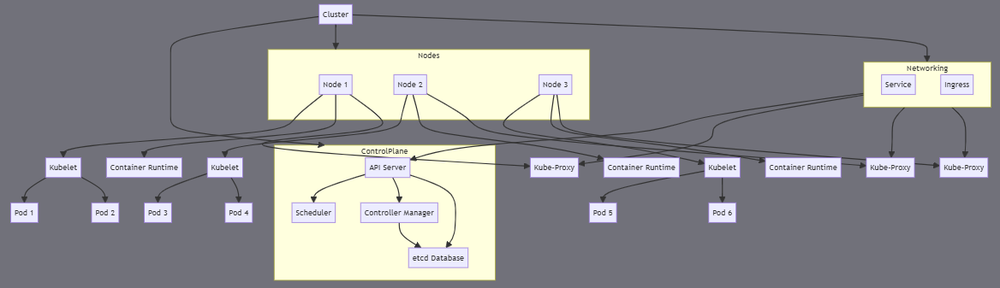

+++
date = '2025-03-09T00:06:00+07:00'
draft = false
title = 'Kubernetes 101'
description = 'Các thành phần cơ bản trong Kubernetes'
tags = ['technical']
+++
# Kubernetes cơ bản

Các thành phần cơ bản trong Kubernetes

*Sơ đồ tổng quan các thành phần cơ bản trong môi trường Kubernetes*

## Cluster

Cluster là môi trường mà Kubernetes sử dụng để triển khai và quản lý các ứng dụng container. Một cluster trong Kubernetes bao gồm:

### Control Panel

Là thành phần trung tâm và quan trọng nhất của 1 cluster. Chịu trách nhiệm quản lý và điều phối toàn bộ hoạt động của cluster. Các thành phần chính:

#### API Server

* Là cổng giao tiếp chính của Kubernetes, xử lý các yêu cầu người dùng, công cụ bên ngoài, hoặc các thành phần khác trong cluster.
* Cung cấp các RESTful API, cho phép tương tác bằng các công cụ như `kubectl`.
* Đóng vai trò trung gian để nhận, xác thực và định tuyến các yêu cầu tới các thành phần khác của Kubernetes.

#### etcd Database

* Là cơ sở dữ liệu phân tán, lưu trữ tất cả thông tin cấu hình và trạng thái hiện tại của cluster.
* Chứa dữ liệu quan trọng của cluster, ví dụ như thông tin về pod, node, cấu hình mạng, ...

#### Scheduler

* Chịu trách nhiệm phân phối các Pod đến các node trong cluster.
* Khi pod mới được tạo ra, Scheduler sẽ xác định node nào sẽ là nói triển khai Pod dựa trên các yêu cầu về tài nguyên (CPU, RAM) và trạng thái hiện tại của các node.
* Đảm bảo phân phối tài nguyên và tối ưu hóa hiệu suất.

#### Controller Manager

*   Là thành phần điều khiển các **Controller (**&#x6E;hững tiến trình theo dõi trạng thái của các thành phần trong cluster và đảm bảo chúng hoạt động theo cấu hình mong muốn.)

    * Node Controller
    * Replication Controller
    * Endpoint Controller
    * Service Account & Token Controllers

### Node

Là các máy tính vật lý hoặc máy ảo, cung cấp tài nguyên để chạy các ứng dụng container.

#### Kubelet

* Agent chạy trên mỗi node. Chịu trách nhiệm nhận các yêu cầu từ Control Panel và đảm bảo các container trong pod chạy đúng.

#### Container Runtime

* Môi trường để chạy các container. Chịu trách nhiệm tải xuống các image container, khởi tạo và quản lý vòng đời của container.
* Các container runtime phổ biến bao gốm Docker, containerd và CRI-O.

#### Kube-Proxy

* Thành phần quản lý mạng trên mỗi node, giúp định tuyến lưu lượng mạng từ bên ngoài vào các pod và từ các pod đến nhau trong cluster.

#### Node có thể bao gồm các loại sau:

1. **Woker Node**:
   1. Là nơi trực tiếp chạy các pod và xử lý các yêu cầu của ứng dụng. Tất cả các worker node trong cluster đều phải có các thành phần như Kubelet, Container Runtime và Kube-Proxy để có thể tương tác và quản lý các Pod.
2. **Master Node:**
   1. Thông thường các thành phần Control Panel như API Server, Scheduler và Controller Manager được triển khai trên một hoặc nhiều master node.
   2. Master node chịu trách nhiệm điều phối các node trong cluster nhưng thường không trực tiếp chạy úng dụng.

### Pod

Là đơn vị triển khai nhỏ nhất và cơ bản nhất. Mỗi Pod đại diện cho một hoặc nhiều container được nhóm lại và hoạt động như 1 đơn vị.

#### Một số thành phần chính trong Pod

* **Container(s)**: Các container trong Pod chạy các phần của ứng dụng hoặc dịch vụ.
* **Volume**: Mỗi Pod có thể gắn nhiều volume để các container trong Pod sử dụng chung. Volume giúp duy trì dữ liệu bất biến ngay cả khi container bên trong bị xóa hoặc khởi động lại.
* **Network Namespace**: Tất cả container trong Pod chia sẻ cùng một không gian mạng, điều này có nghĩa là chúng sử dụng chung một IP và có thể giao tiếp với nhau thông qua `localhost`.

### Service

**Service** là một khái niệm trong Kubernetes dùng để định danh và cung cấp một endpoint ổn định cho một nhóm Pod. Vì các Pod có vòng đời ngắn và IP của chúng có thể thay đổi khi bị xóa và tạo lại, Service đóng vai trò là một lớp trừu tượng để tạo địa chỉ IP tĩnh và ổn định cho các Pod, giúp dễ dàng giao tiếp với nhau trong cluster.

**Các loại Service trong Kubernetes:**

* **ClusterIP**:
  * Đây là loại Service mặc định trong Kubernetes.
  * Service loại này chỉ có thể truy cập từ bên trong cluster và không thể truy cập trực tiếp từ bên ngoài.
  * ClusterIP tạo một IP nội bộ cho Service, giúp các Pod trong cùng một cluster có thể giao tiếp với Service qua IP này.
* **NodePort**:
  * Service loại này mở một cổng (port) trên mỗi node trong cluster để ánh xạ tới Service.
  * NodePort cho phép truy cập từ bên ngoài cluster bằng cách sử dụng IP của node và cổng đã được ánh xạ.
  * Đây là cách đơn giản nhất để cung cấp một endpoint bên ngoài cluster, nhưng không tối ưu cho việc triển khai ở quy mô lớn.
* **LoadBalancer**:
  * LoadBalancer cung cấp một địa chỉ IP công khai để Service có thể truy cập trực tiếp từ bên ngoài cluster.
  * Service này tích hợp với các dịch vụ Load Balancer của nhà cung cấp cloud (như AWS, GCP, Azure) để tạo IP bên ngoài.
  * Đây là một cách tiếp cận phổ biến để cung cấp một endpoint bên ngoài cluster cho các ứng dụng production, giúp cân bằng tải và tăng tính sẵn sàng.
* **ExternalName**:
  * Service loại này ánh xạ một tên DNS bên ngoài tới một tên DNS nội bộ.
  * ExternalName không tạo IP hay cổng cho Service mà chỉ trả về tên DNS của một dịch vụ bên ngoài.

### Ingress

**Ingress** là một thành phần trong Kubernetes cung cấp quyền truy cập từ bên ngoài vào các dịch vụ trong cluster. Nó hoạt động như một load balancer hoặc proxy, giúp định tuyến lưu lượng mạng đến các Service bên trong cluster dựa trên các quy tắc định tuyến cụ thể.

## Các port quan trọng, phổ biến

<table><thead><tr><th width="252">Thành phân</th><th width="130">Port</th><th>Mô tả</th></tr></thead><tbody><tr><td>Kubernetes API Server</td><td>6443</td><td>Port chính của API Server</td></tr><tr><td>etcd</td><td>2379</td><td>Port API của etcd để lưu trữ trạng thái cluster</td></tr><tr><td>etcd Peer</td><td>2380</td><td>Port giao tiếp giữa các thành viên của etcd</td></tr><tr><td>Kube Controller Manager</td><td>10257</td><td>Health check của Controller Manager</td></tr><tr><td>Kube Scheduler</td><td>10259</td><td>Health check của Scheduler</td></tr><tr><td>Kubelet</td><td>10250</td><td>API của Kubelet</td></tr><tr><td>Kubelet Read-Only</td><td>10255</td><td>Chế độ chỉ đọc của Kubelet (không bảo mật, thường vô hiệu hóa)</td></tr><tr><td>NodePort Range</td><td>30000-32767</td><td>Dải port mặc định cho các Service loại NodePort</td></tr><tr><td>Kube Proxy Health Check</td><td>9099</td><td>Health check của Kube Proxy</td></tr><tr><td>Weave Net</td><td>6783, 6784</td><td>Port giao tiếp dữ liệu và điều khiển của Weave Net</td></tr><tr><td>BGP (Calico)</td><td>179</td><td>Port giao tiếp BGP trong một số plugin mạng</td></tr><tr><td>Ingress (HTTP/HTTPS)</td><td>80, 443</td><td>Port cho lưu lượng HTTP/HTTPS từ Ingress Controller</td></tr></tbody></table>

### Các port của Control Panel

* **6443**: Port của **Kubernetes API Server**.
  * Đây là port chính cho API Server, chịu trách nhiệm nhận các yêu cầu từ `kubectl`, các thành phần bên trong Kubernetes, và các dịch vụ khác.
  * Đây là port mặc định để tương tác với API Server và thường được bảo vệ bằng TLS.
* **2379-2380**: Port của **etcd**.
  * **2379**: Port mà etcd sử dụng để phục vụ các yêu cầu API. Đây là nơi lưu trữ toàn bộ trạng thái của cluster.
  * **2380**: Port để các thành viên trong cụm etcd giao tiếp với nhau (peer communication).
  * Đảm bảo bảo mật cho các port này là rất quan trọng vì etcd chứa thông tin nhạy cảm về cluster.
* **10257**: Port của **Kube Controller Manager**.
  * Port này được sử dụng để thực hiện các kiểm tra sức khỏe nội bộ của Controller Manager.
* **10259**: Port của **Kube Scheduler**.
  * Port này được sử dụng để thực hiện các kiểm tra sức khỏe nội bộ của Scheduler.

### Các port của Node

* **10250**: Port của **Kubelet**.
  * Port này là endpoint API của Kubelet, dùng để giao tiếp với API Server và các công cụ quản trị khác. Nó cho phép API Server truy cập vào logs, thực hiện lệnh `kubectl exec`, và kiểm tra trạng thái của các container trên node.
* **10255**: Port của **Kubelet Read-Only** (không bảo mật).
  * Port này cung cấp các thông tin không bảo mật về node và Pod ở chế độ chỉ đọc. Tuy nhiên, do không được bảo mật nên nó thường được vô hiệu hóa trong các phiên bản Kubernetes mới hơn.
* **30000-32767**: **NodePort Range**.
  * Đây là dải port mặc định cho các Service loại **NodePort** trong Kubernetes.
  * NodePort sẽ mở một port ngẫu nhiên trong khoảng này trên mỗi node, cho phép truy cập vào các dịch vụ trong cluster từ bên ngoài qua IP của node và cổng đã được ánh xạ.

### Các port khác

* **9099**: Port của **Kube Proxy Health Check**.
  * Port này được sử dụng bởi **Kube-Proxy** để kiểm tra sức khỏe của chính nó.
* **6783** và **6784**: Port của **Weave Net** (một CNI plugin phổ biến cho Kubernetes).
  * **6783**: Dùng cho giao tiếp dữ liệu của Weave Net.
  * **6784**: Dùng cho giao tiếp điều khiển của Weave Net.
* **179**: Port của **BGP** (Border Gateway Protocol) trong một số plugin mạng như Calico khi sử dụng BGP để định tuyến.
  * Port này cho phép các thành phần mạng trong Kubernetes giao tiếp qua BGP.

### Port của Ingress và Load Balancer

* **80** và **443**: Các port phổ biến cho **HTTP** và **HTTPS** của Ingress.
  * **80**: Dùng để xử lý lưu lượng HTTP không mã hóa.
  * **443**: Dùng để xử lý lưu lượng HTTPS (TLS termination).
  * Các port này giúp Ingress Controller nhận và định tuyến lưu lượng mạng đến các dịch vụ trong cluster.
* **Xác định bởi Load Balancer**: Khi sử dụng **Service loại LoadBalancer**, port của Load Balancer có thể được cấu hình tùy ý tùy thuộc vào thiết lập của nhà cung cấp cloud (như AWS, GCP, Azure).

## References

* [Hacktricks](https://cloud.hacktricks.xyz/pentesting-cloud/kubernetes-security/kubernetes-basics)
